# Introduction

Hello! We are Alvin Jiang and Chen Guanzhou, developers of Close
Contact, an android friend-finding app, and this is our readme, which
also serves as a documentation to why and how we came to undertake this
project. Throughout this document, you will understand why we believe
our project is meaningful and the motivation behind it.

We will also elaborate on the features that we have decided to
implement, providing a program flow to understand how our app is
structured. After which, we detailed the various Software Engineering
Principles we have adopted, followed by the project log to detail the
time each of us have spent over the course of this project.

# Motivation 

As students facing the challenges of interacting with others amidst the
COVID-19 situation, we find it difficult to get to know others, and
increase our social circle.

Many students find themselves craving social interaction with others,
with high levels of loneliness reported in college students[^1]. An idea
of a social networking app, made for students, can increase one's
exposure to others such that they can make more friends.

# Aim 

We hope to create a social app that University students can make use of
to find other students of the same course/hobbies/activities that they
are keen on. Using a matchmaking system, we can allow students to swipe
through the profiles of others, and chat with those they are interested
in.

The app will serve to improve and enhance social interactions by
providing a platform that allows for social interaction between
students. This promotes more social activity within NUS students which
has been painfully lacking, especially in recent years.

# User Stories

1.  As a student, I want to be able to customize my profile to include
    my course, hobbies, activities that I am looking to do with others.

2.  As a student, I want to be able to message other users on the app.

3.  As a student, I want to be able to look at the profiles of other
    users of the app, and swipe right or left depending on whether I am
    interested in interacting with them.

4.  As a student, I want to be able to see when others request to chat
    with me, and accept or decline accordingly.

5.  As a student, I want to be able to report others who abuse the
    platform, and send messages to the administrator.

6.  As an administrator, I want to be able to receive feedback from
    users regarding the platform and respond to messages sent by users.

# Tech Stack

1.  Flutter/Dart (Frontend)

2.  Firebase (Backend)

3.  Android Studio (IDE)

# Code Base

[[https://github.com/Guanzhou03/closecontact]{.underline}](https://github.com/Guanzhou03/closecontact)

# Deployment

To try the app out yourself, download the apk here:

[**[https://drive.google.com/file/d/1UpY7zVAml_6G90qV2IdoBKcsFMvDqI-s/view?usp=sharing]{.underline}**](https://drive.google.com/file/d/1UpY7zVAml_6G90qV2IdoBKcsFMvDqI-s/view?usp=sharing)

# Features and Timeline

**As we update on our readme over the course of the project, we will
have decided to make use of this section to review our goals over the
Milestones.**

## Features to be completed by Milestone 2: 

1.  Creating and Customizing Profile

    a.  Users can select their course of study, interested activities,
        hobbies, from a given list, which will be displayed on their
        profile. ✅

    b.  Users can upload and display a profile picture. ✅

    c.  Users can write a short biography about themselves, which will
        be displayed on their profile. ✅

2.  Messaging System

    a.  Allow users to message other users. ✅

    b.  Allow users to send messages to the administrator. ✅

        i.  Completed as of Milestone 3

3.  Request Handling System

    a.  ~~Allow users to see their sent requests~~ ❎

        i.  We have since decided to remove this feature, as we do not
            think the benefits it brings is significant enough to
            justify the work necessary, and it also does not negatively
            affect any of our user stories.

    b.  Allow users to see their incoming requests, and accept or
        decline accordingly. ✅

4.  Matchmaking System

```{=html}
<!-- -->
```
a.  Swiping system allows users to connect with others, swiping right
    automatically sends the other party a chat request, which can be
    accepted by the other party. Swiping left will allow the user to
    skip the current profile. ✅

## Features to be completed by Milestone 3: 

1.  Allows users to filter out profiles with certain characteristics (eg
    Course/Gender). ✅

2.  Implement a feedback system for users to report bugs, other users.
    ✅

3.  Mechanisms to collect datasets for analysis. ❎

    a.  For this portion, we were unable to explore mechanisms to
        collect datasets, although firebase console provides an easy way
        for us to look at the data within the database.

4.  **Improve on current core features to increase options for users
    (new).**

    a.  **Swipe System to allow users to swipe once on every other user
        only.** ✅

    b.  **Messaging System to allow sending of images, videos etc.** ✅

    c.  **Profile Page to allow for greater customization.**✅

5.  **Improve on current User interface to increase intuitiveness for
    users. (new)** ✅

6.  **Implement an algorithm that recommends profiles based on
    "similarity" (new)** ✅

7.  **Improve current testing methods. (new)** ✅

    a.  While we made some small improvements, we did not deviate much
        from our testing techniques as implemented in Milestone 2. This
        will be further elaborated upon under the Quality Assurance
        Section.

8.  User verification system to prevent misuse. ✅

    a.  Already implemented in Milestone 2

**Possible extensions on our app in the future:**

Looking beyond Milestone 3, we could potentially explore these following
features, although it is not a priority at this stage of development.

-   Data on profiles which are swiped left/right by the user can also be
    stored to provide even better recommendations to enhance user
    experience using data analysis.

-   Extend beyond NUS into university students in Singapore/students in
    general

-   We would like to further explore administrator versions of the
    application, which we have ideated upon but did not have the time to
    implement.

**How are we different from other platforms?**

1.  **Social media platforms (Instagram/Facebook/Twitter)**

> Our platform focuses on allowing NUS students to make friends and
> connections with other NUS students. Social media platforms do not
> narrow down the demographic to NUS students specifically, and it is
> much easier to make friends and connections with our product than with
> these social media platforms.

2.  **Matchmaking/Dating platforms(Tinder/Bumble)**

> Our platform provides a safe environment for students to interact and
> make connections with other students. The students must be verified by
> their NUS email and are not anonymous and users can report any
> offences/offenders through the app and they will be directed to the
> relevant authorities. Other matchmaking apps like Tinder may not be as
> safe, and are not limited to just students so it may be harder for our
> users to make connections with people that are similar to them. (NUS
> students looking for NUS students to befriend/date)

3.  **Social applications targeted at NUS Students (NUS Chat Bot)**

> Although these applications target NUS/University students in general,
> they do not contain details about the user such as their hobbies and
> interests. There are also no avenues for them to share photos of
> themselves, compared to our app. Matchmaking is also done on a random
> basis and not based on direct chat requests. Our app shows interests
> and details of a user so interested users can reach out and make
> friends with them.

# Project Scope

This section of the readme covers the login and authentication process,
key functionality of the application and extensions that can enhance
user experience.

**Authentication** - User registration and login with verification using
NUS email address.

**Key functionality** - Core features including home page, profile page,
and chats page

**Extensions** - Users can filter profiles, use a feedback system/report
system, allow users to upload images/other media, and make use of a user
recommendation system.

##  Milestone 1: User registration and login

### Frontend routing with login and register page

> 1.1. Set up routing from the login page to the home page.
>
> 1.3. Register page
>
> 1.4 Login Page
>
> 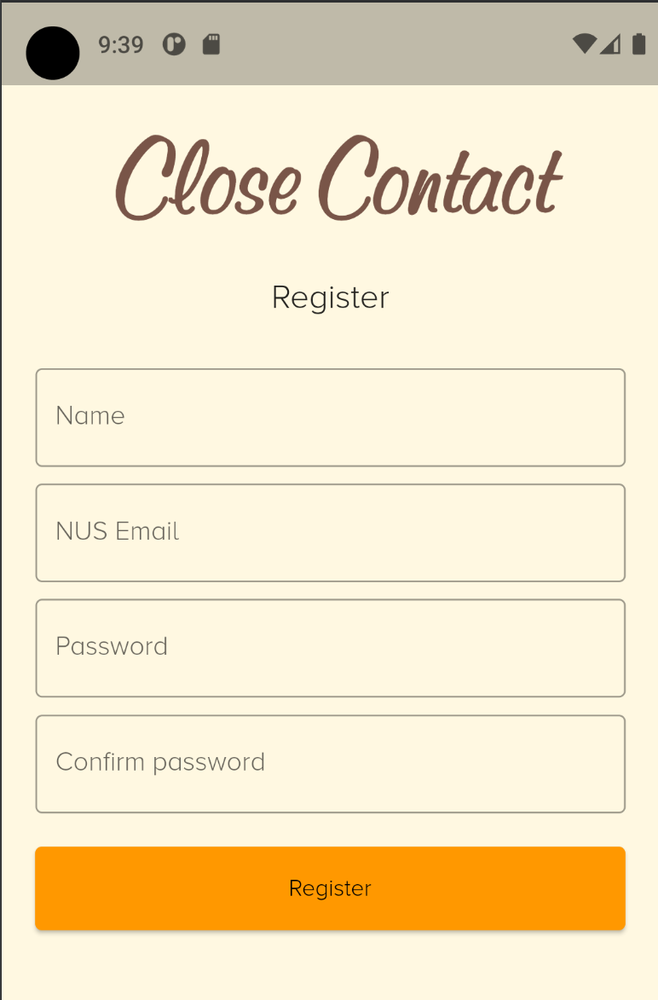{width="3.3761745406824146in"
> height="5.114502405949256in"}{width="2.9843755468066493in"
> height="5.047646544181977in"}

Login page Register page

### Backend endpoints API and database

> 2.1 Setup backend API endpoints and a database for user registration
> and login using Firebase Authentication.

2.2 Users must register and login in order to use the app as intended.

## Milestone 2: Core features including Home page, Profile page, Chat requests and messaging features, and improvements from MS1

### Email verification with Firebase Authentication 

> Users must verify their email using their NUS email address when they
> register.
>
> 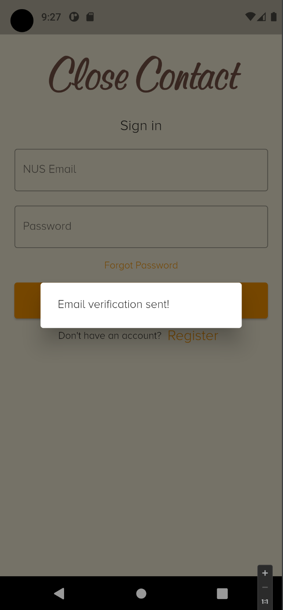{width="2.2031255468066493in"
> height="4.697017716535433in"}

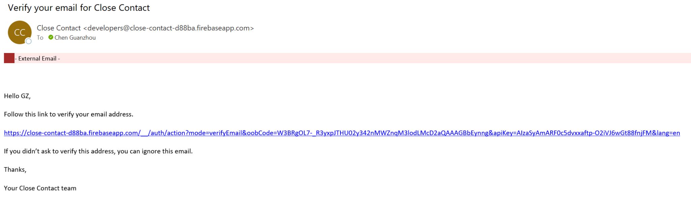{width="10.380905511811024in"
height="3.039387576552931in"}

> *Verification email*

*Alert to display email verification sent*

### Forget password feature 

> Users can reset their password and the link to reset password will be
> sent to their registered NUS email address.
>
> 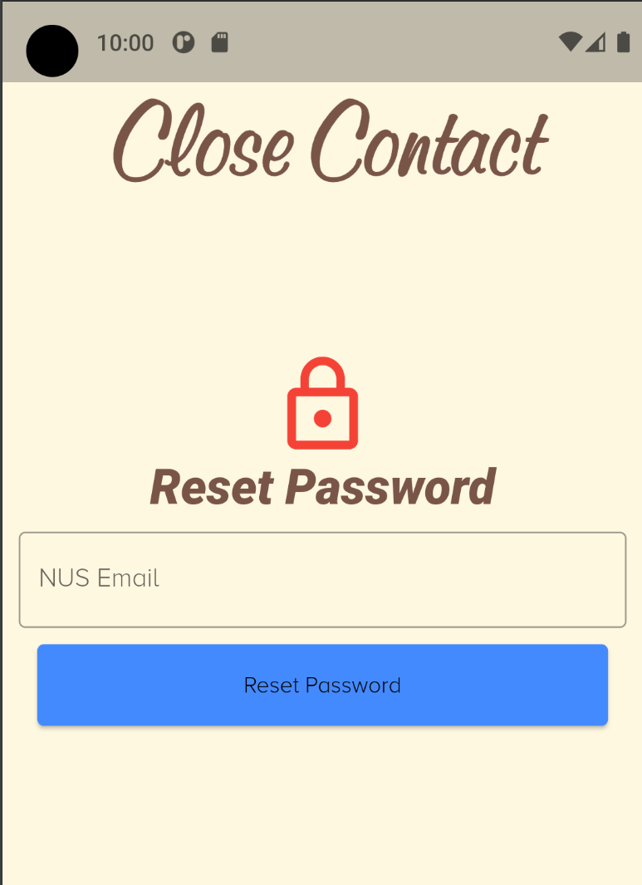{width="2.8593755468066493in"
> height="3.9428105861767277in"}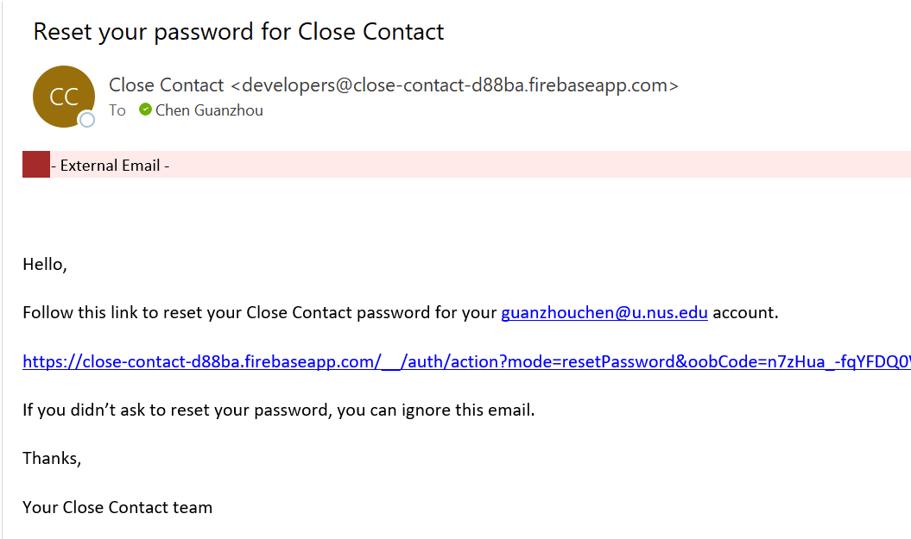{width="6.317708880139983in"
> height="3.735952537182852in"}
>
> Reset password email

Reset password page

### Home page

After logging in, users will be brought to the home page where they can
see other profiles, and users will be able to swipe left/right for each
profile they see, until there are no more profiles left. Swiping right
sends a chat request to the other user while swiping left skips the
user.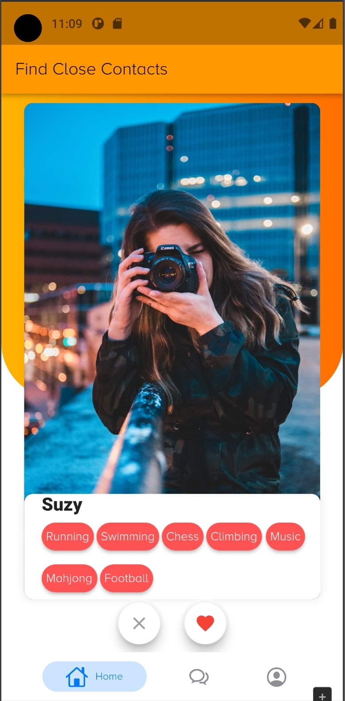{width="2.6093755468066493in"
height="5.312781058617673in"}

> Sample home page profile

### 

### 

### 

###  Profile page

Users can navigate to their profile page to update their profile
information. Users must provide their information so that they can
participate in swiping and other app activities. Users with an
incomplete profile (missing information in My Profile page) cannot swipe
right on other users.

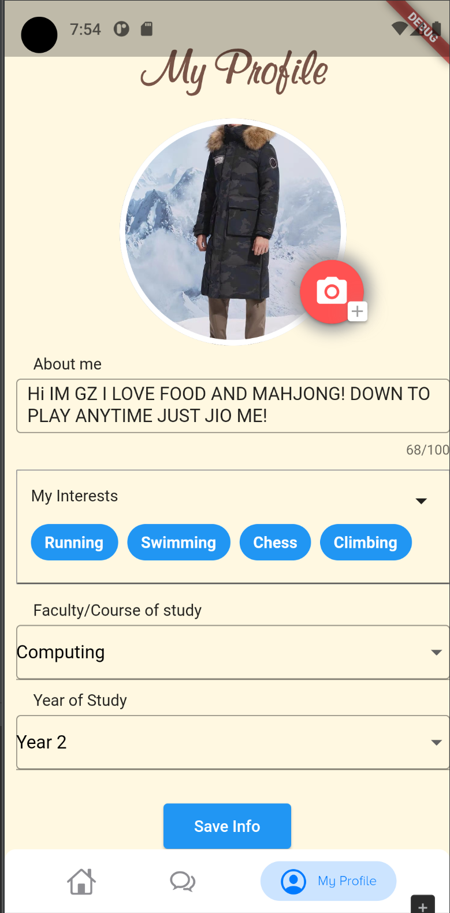{width="3.244792213473316in"
height="6.560464785651794in"}

> Sample profile page

### 

###  Chats Page

Users can also navigate in the navigation bar at the bottom to the chats
page, where their current chats are. A chat room is created and shown in
this page once the user accepts a chat request from another user, or
another user accepts the current user's chat request. They can tap into
their current chat to view chat messages and continue chatting.

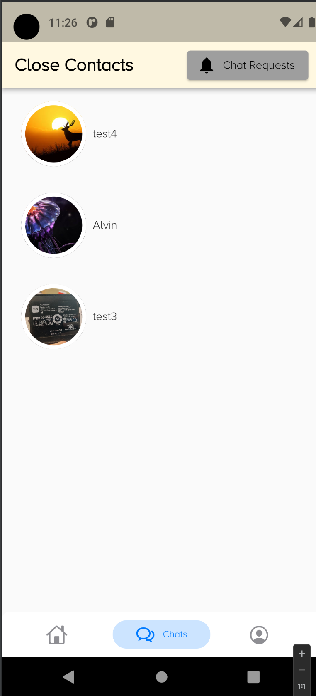{width="2.789206036745407in" height="6.125in"}

Sample chats page of current chats

### Chat Requests Page

From the Chats Page, users can tap into the chat requests page on the
top right of the Chats Page screen. Here, the users can see all incoming
chat requests from other users. Users can tap into the profile avatar to
see information about the user sending the chat request. In the chat
requests page, users can swipe right to accept the chat request or swipe
left to dismiss the request.
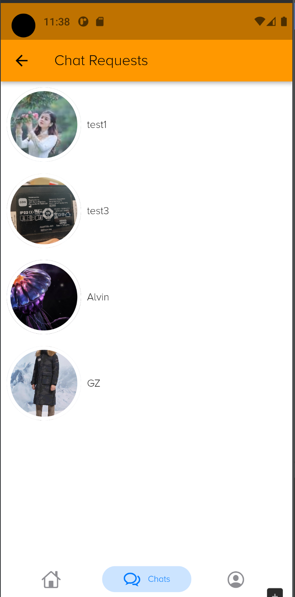{width="2.929024496937883in"
height="5.91923009623797in"}

{width="2.9843755468066493in"
height="6.128057742782152in"}

Sample chat request screen

User's information after avatar tap

###  Individual chat room

Here is where users chat with one another in private. The messages are
displayed based on the time of the message, with the latest message
shown first.

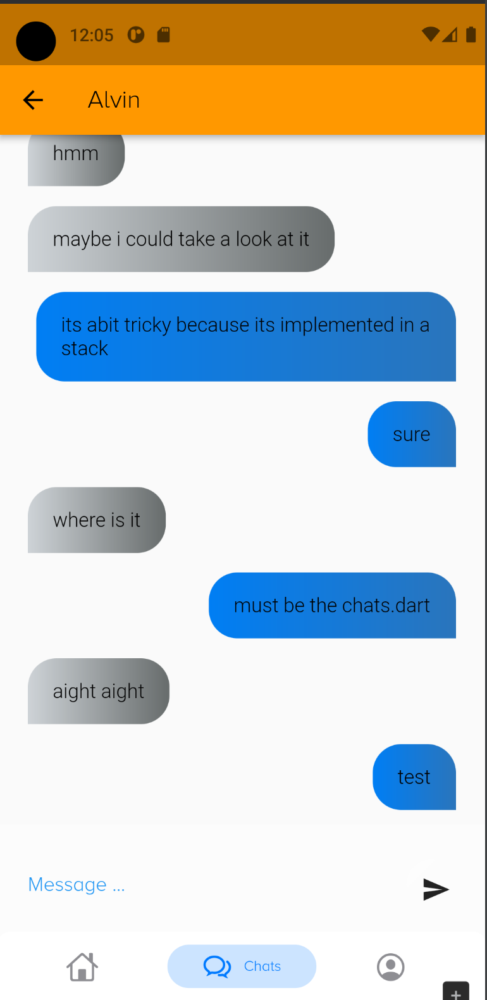{width="3.4843755468066493in"
height="7.1474354768153985in"}

Sample chat room

## 

## Milestone 3: Extensions, optimizations and improvements to existing features to improve user experience and usability.

###  Chat Requests Improvements

Users will now be able to make the decision to accept or decline
incoming chat requests

after tapping into the incoming user's profile info, using intuitive
accept or decline buttons. This is an improvement as feedback has been
given regarding the unintuitive swiping in the chat request page
previously as users did not know they had to swipe.

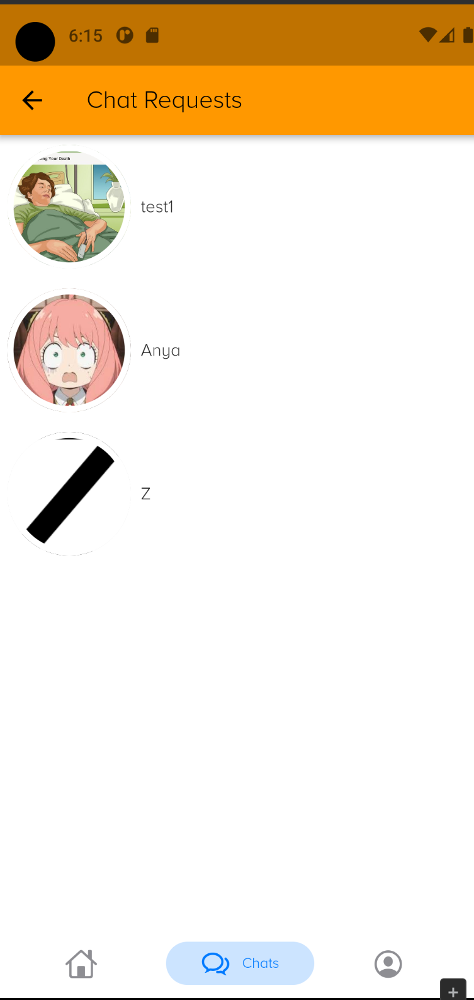{width="3.272255030621172in"
height="6.899089020122485in"}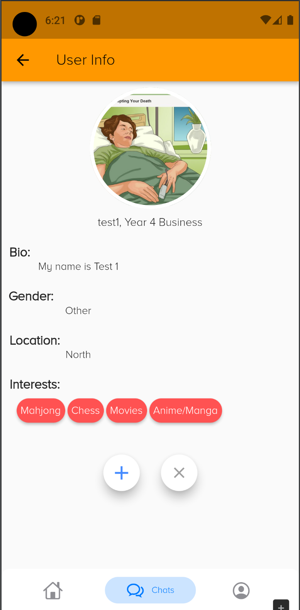{width="3.433023840769904in"
height="6.972005686789151in"}

**→**{width="6.5in"
height="13.180555555555555in"}

**Tap on profile**

###  Profile page improvements

There are now more fields for user to provide their information so other
users can get to know them better. Gender, area/location, and more
interests have been added. Should users not want to share these
information, we have also added an option for them to choose not to
reveal their information. There are also improvements in text alignment.

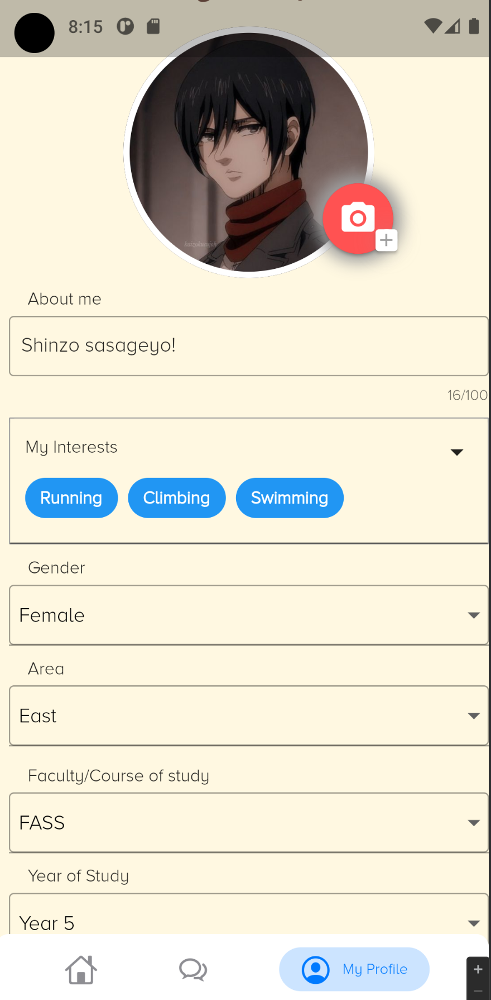{width="2.9895833333333335in"
height="6.058436132983377in"}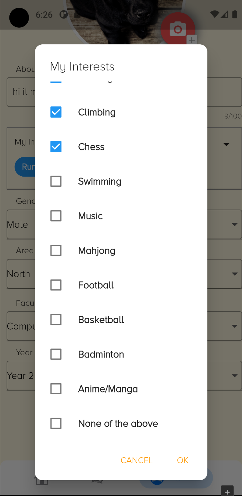{width="2.9244586614173227in"
height="5.964355861767279in"}

Choose Interests Added gender and area fields

###  Set user preferences and filter out profiles

Users can now set their preferences in the filter profile page, and only
filtered profiles will be shown in the home page. Users can select any
number of preferences, including everything which will show all
available profiles. If no profile matches the preferences, the home page
will show no profiles.

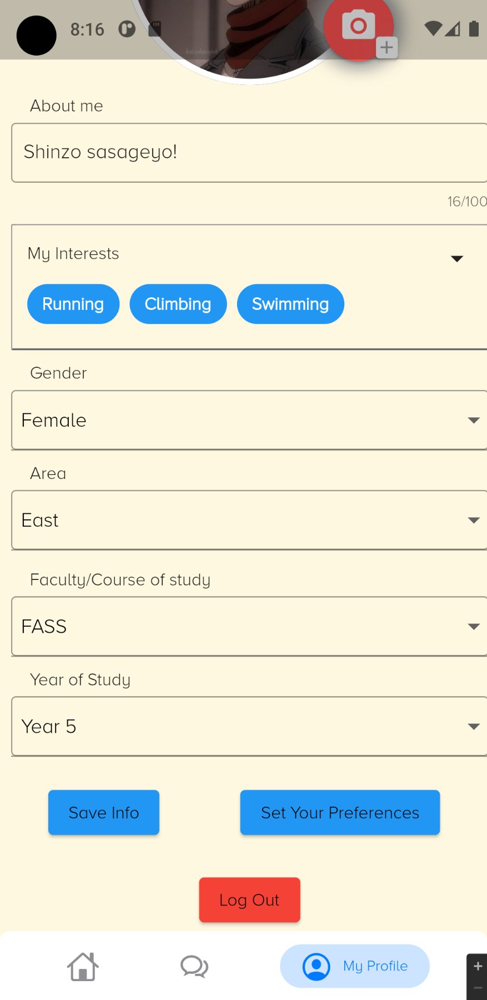{width="3.0816557305336834in"
height="6.333333333333333in"}{width="3.2395581802274718in"
height="6.333699693788277in"}

> **→**

Profile page Set your preferences

###  Recommendation algorithm implementation

We have implemented a recommendation algorithm, where profiles that
users may be more likely to be interested in are shown first in the home
page. We use a simple interests-matching algorithm to calculate the
similarity score between the interests of any two users. We sort the
list of profiles on the stack using this similarity score, to allow
profiles with similar interests to the user be shown first, enhancing
the user experience.

For example, if user X matches all my interests listed in my profile,
then user X will have the highest similarity score and will appear first
for me to swipe in the home page. This will be particularly useful
especially then the number of profiles increases.

Example: The profile with 3 out of 4 similar interests (highest among
all profiles) appears first.

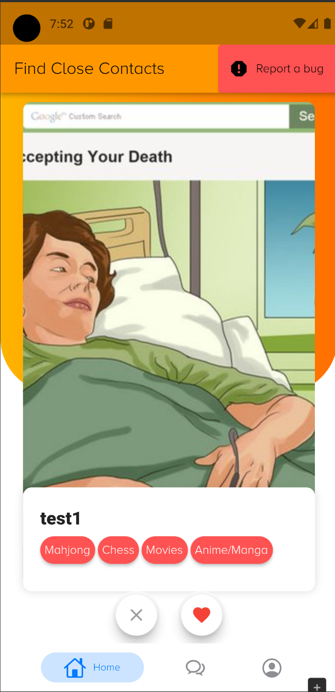{width="3.2968755468066493in"
height="6.812568897637795in"}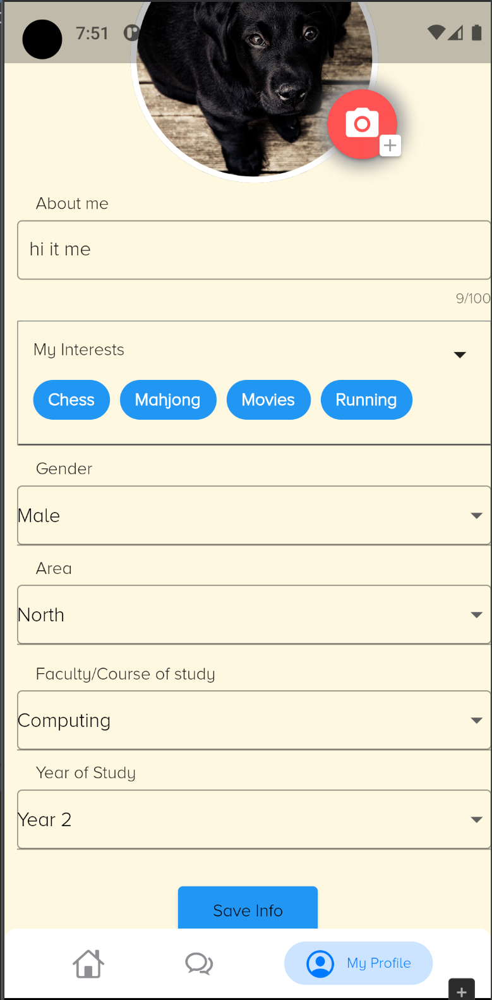{width="3.3172594050743656in"
height="6.726155949256343in"}

###  Image uploading feature

On top of the text messaging feature we implemented previously, we have
implemented an image uploading feature. Users can choose an image from
their device and send
it.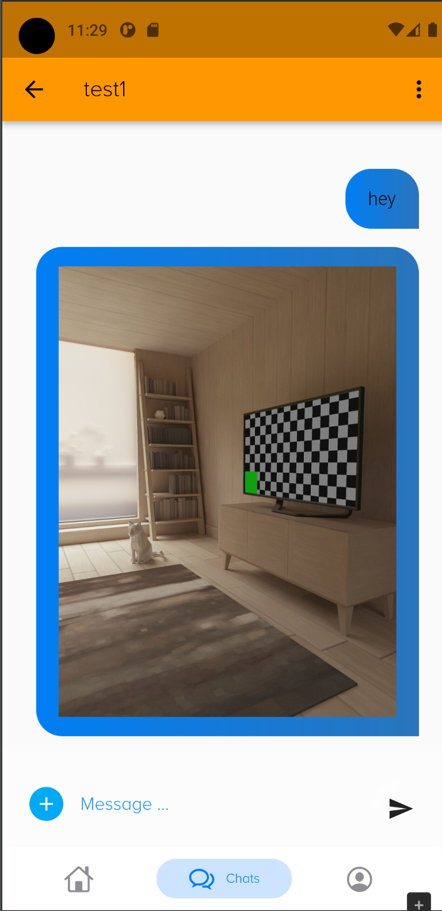{width="3.6927088801399823in"
height="7.598458005249344in"}

Image sent using the upload button on the left

###  Report user feature

We have implemented a report user feature where users can report other
users that they are chatting with. For example, if someone is suffering
from harassment, they can report the user to the admin and explain the
issue to the admin. The admin will be notified and are able to report
these perpetrators to the relevant authorities if necessary,

{width="3.5520833333333335in"
height="7.300294181977253in"}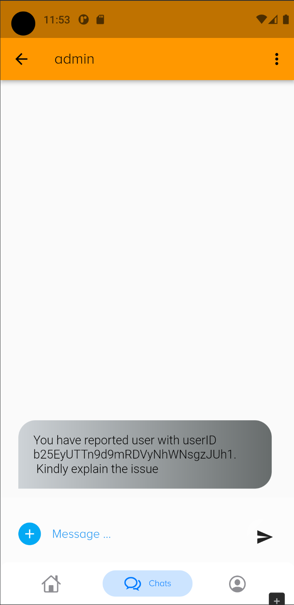{width="3.5476017060367453in"
height="7.239583333333333in"}

**→**

After tapping top-right menu After report, chat with admin

###  Block/unblock user feature

Users can block/unblock other users. Blocked users will not be able to
send messages

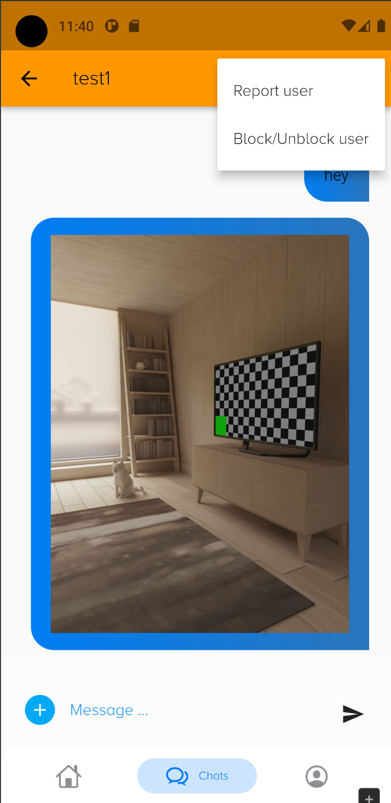{width="3.4895833333333335in"
height="7.132314085739282in"}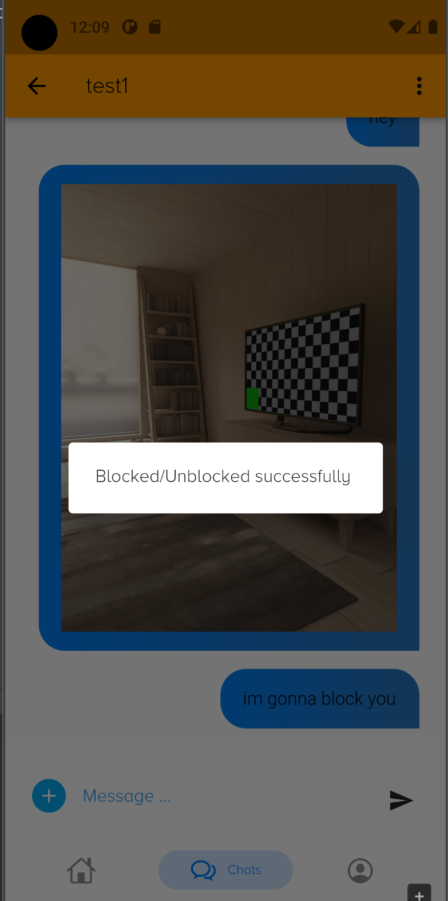{width="3.48496719160105in"
height="6.982380796150482in"}

**→**

After tapping top-right menu Alert appears to inform user

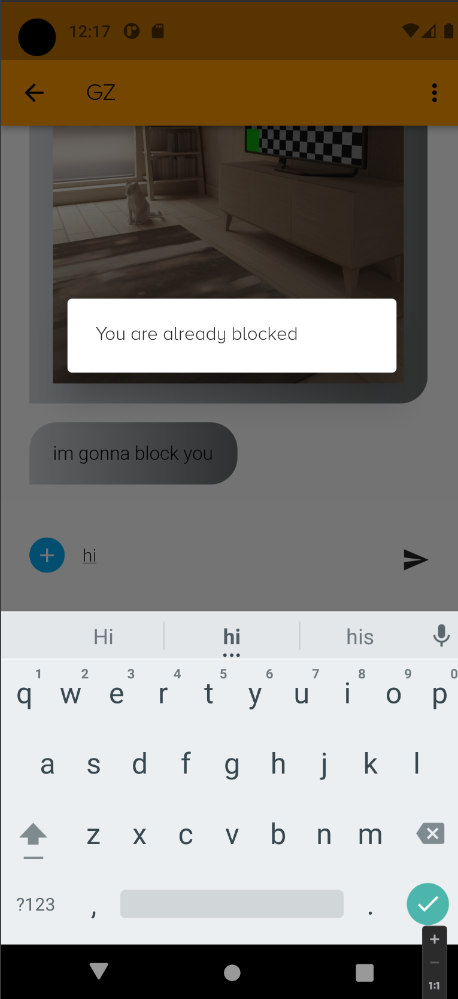{width="3.009239938757655in"
height="6.578125546806649in"}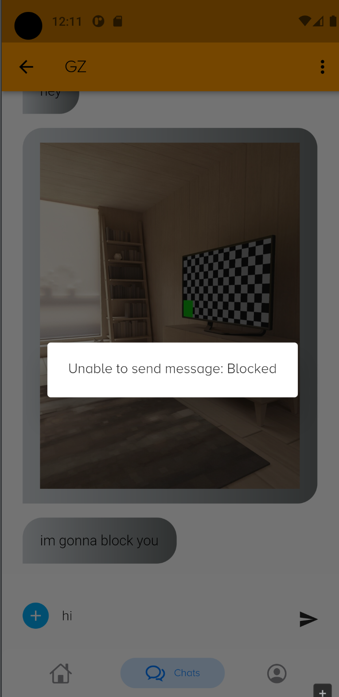{width="3.1664720034995626in"
height="6.515625546806649in"}

If blocked user tries to send a message If blocked user tries to unblock

###  Feedback/report bugs feature

Users can report any bugs/problems with the app or any feedback in
general using the report a bug button in the home page.

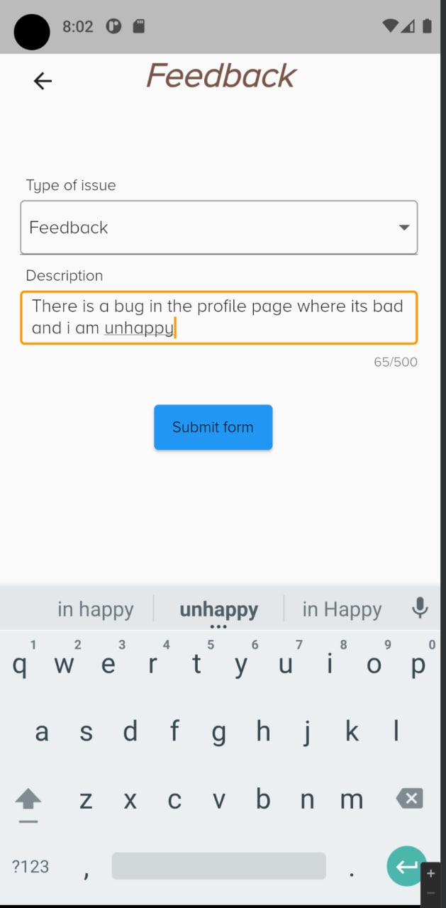{width="3.2083333333333335in"
height="6.516149387576553in"}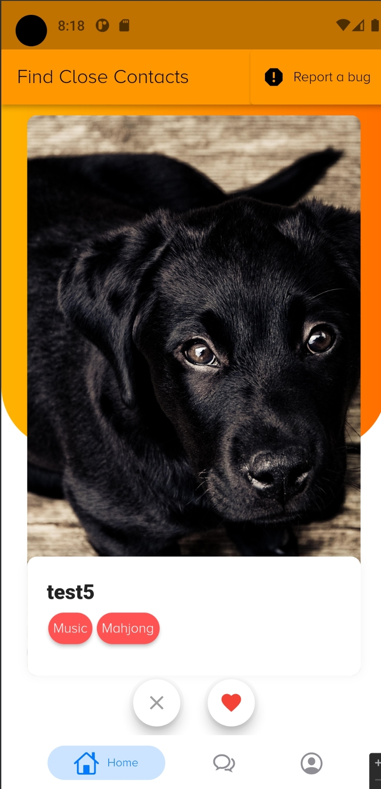{width="3.1628608923884514in"
height="6.520833333333333in"}

**→**

Report/feedback on top right Submit feedback form

###  Delete chat feature

Users are able to delete chats by touching and holding a chat until an
alert pops up that allows them to delete the chat. This will help to
smoothen their user experience. For example, if a user has been reported
to the admin and the issue has been solved, they can delete and close
the chat with the
admin.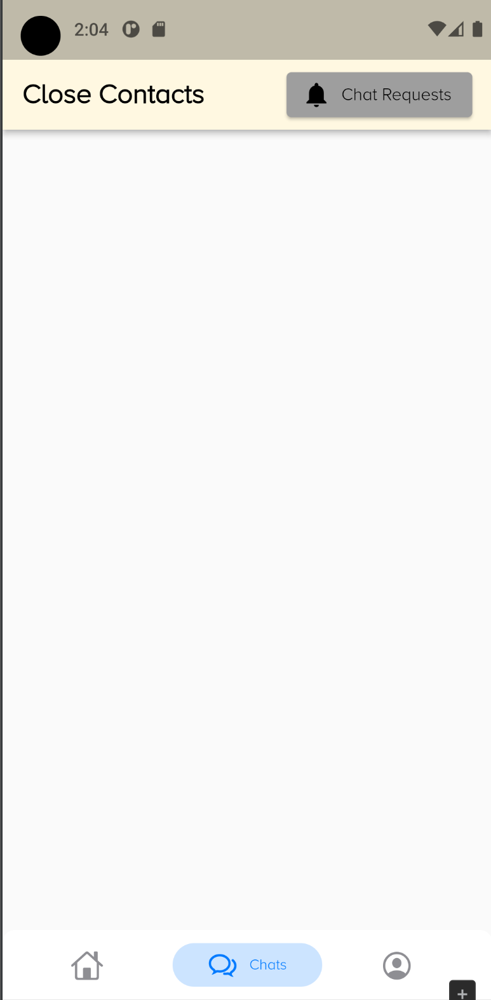{width="3.6354166666666665in"
height="7.4024781277340335in"}

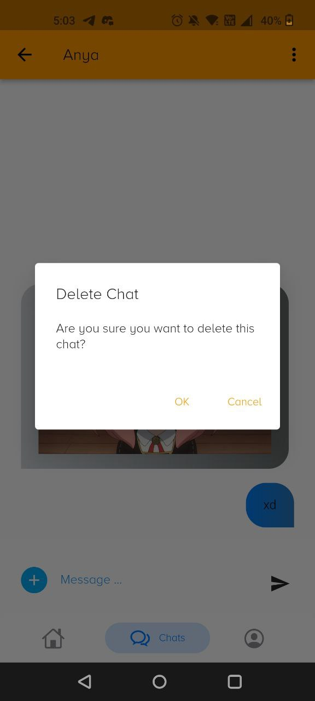{width="3.244792213473316in"
height="7.212055993000875in"}

**→**

After tapping delete on top-right After deleting

# Challenges Faced

## Future-proofing of Code

Throughout our journey during orbital, we implemented many different
features, that all build upon the previous features. Because of this, we
had to make sure that the code we write is future proof, such that our
**future features do not break or cause our previous features to
break.** In addition, it proves difficult to change any data structures
that we have chosen previously to store our information. An example of
this would be our Multi-Select Form Field, to store lists of interests.

Changing the implementation for this particular widget was challenging,
as **many other widgets depend on this widget and it required a
List\<String\> to work**. This made it difficult to change the
implementation of an interest selector during Milestone 3, even though
we received feedback that users would like to key in their own
interests.

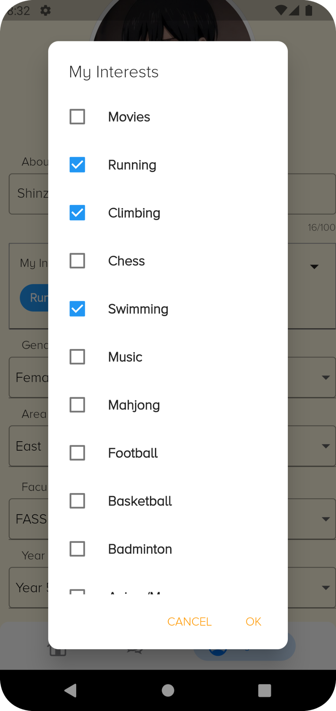{width="2.6979166666666665in"
height="5.052002405949256in"}

Multi-select Form Field

## Asynchronous Programming

We realised the importance of asynchronous programming. Throughout the
software development, we ran into **many issues that would have been
easily solved with a good understanding of asynchronous programming**.
We had to learn the syntax in Dart, and learning how to make use of
asynchronous calls to assist us. This was difficult as many of our
widgets required some sort of asynchronous programming. In this same
respect, **Firebase methods are all asynchronous calls as well**.

With a mastery of this, we were able to create widgets that are well
integrated with the firebase backend. An **example of this is the swipe
card, which builds a list using a series of asynchronous snapshots**.

## Real time updates 

We managed to implement most of the features without too much
difficulty, however **implementing it with real time updates was much
more difficult**. For example, when a user is in a chat and the other
user decides to block the current user, the blocked user must
immediately be unable to send messages without the need to refresh or
re-render the chats page. If not, the purpose of the block feature would
be much less meaningful if the user did not want to receive any more
messages immediately. We **used a listener for this problem to listen to
state changes and update the block status accordingly**.

Other less important but still good to have examples include **real time
updates for when a chat request is sent while the user is on the chat
requests page, or when a user accepts your chat request when you are on
the chats home page**. Without the user deliberately refreshing or
re-rendering the page, it was a challenge to implement the features that
work in real time.

## Implementation of specific features

The implementation of specific features, particularly the swipe card
feature and the chatting feature, which are core features of our app,
were extremely difficult for us due to the **complexity of the features
and the lack of any prior development experience** with Dart in our
team.

The chatting feature was incredibly complex because there are many parts
to it and we must be very clear about each part. We had to **implement a
message model, database methods for reading and writing data, and plan
on the organisation and storage of the messages and chat rooms in
Firestore, while handling messages sent with real-time updates for both
users, as well as the correct ordering and frontend display of the chat
messages.**

The swipe feature was very challenging because it was a **key component
that was required very early** and had to be implemented before the
chatting feature. It was complex as it **consisted of gesture detection
of swiping and it is the only place in our app where animations are used
when users swipe left or right**. The action also sends a chat request
to the other user so backend support was required to organise the
information. Later on, we also had to make it such that swiped users do
not appear again and users are also ordered based on the similarity of
their interests, as well as filtered profiles to improve the user
experience.

# 

# Bugs Squashed

This section covers the bugs we have encountered during the
implementation of the features above, and how we managed to squash them.

## Chatting feature timestamp

In the database, the messages in a chat room are ordered
chronologically, so that we are able to display the latest message first
and the chat page has the correct order of messages shown as expected in
a chatting feature. However, the way we retrieve the timestamp is using
the user's device time, and we **noticed not all users have the same
accurate time on their devices**. This also affects users from other
timezones, and causes messages to be ordered incorrectly (for example
new messages shown on top instead of at the bottom of the chat).

In order to squash this bug, we **made use of the Network Time Protocol
(NTP) package, which is able to get the precise time from NTP. We use
the NTP to get the offset from the current device time to the real
precise time**, and simply add the offset to the device time to get the
real time. In this way, all messages sent will be standardised to
precise time from NTP. The following shows the code implementation in
Dart:

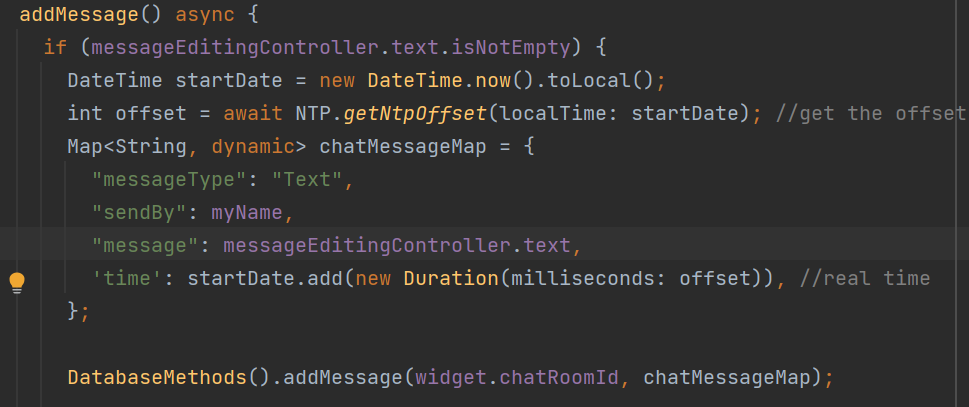{width="6.5in" height="2.736111111111111in"}

## Block/unblock users

The way we implemented the block user feature is to find the chat room
that the user initiated the block in, and block out the chat room so
that no messages can be sent by either user once a block has been
initiated. However, **this resulted in the blocked user being able to
unblock the chat and send messages, which is not intended**.

To solve this, we created an initiator field in the database for each
chat room on top of the isBlocked field, and **if there is an initiator
that is not the current user, the current user will not be able to
unblock the chat**. Once unblocked, the initiator field becomes empty
and either user can block again.

After we solved this bug, we noticed that the blocking does not work in
**real time chat when the blocked user stays on the chat page since
there is no re-rendering of the chats page**. Therefore we do not
retrieve the updated blocked status from the database. The blocked user
is still able to send messages if he stays on the chats page without
refreshing. To solve this issue, we added a listener to assign the block
state correctly in real time so that blocking will immediately take
effect even when the blocked user stays on the page. The following shows
the code implementation in Dart:

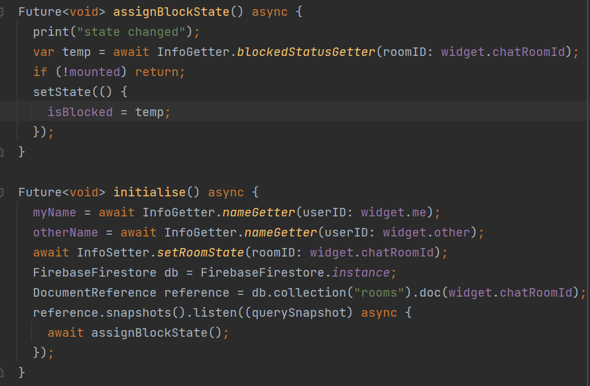{width="6.5in" height="4.25in"}

The listener that was added in order to enact real time changes

## Swiping and chat requests

There is a bug where there can be **multiple chat requests from the same
user**, because the card stack does not keep track of the profiles that
the current user has already swiped on. To fix this bug, we created a
list of profiles in the database that each user has seen and swiped on,
so that there will not be repeated swiping on the same profiles.

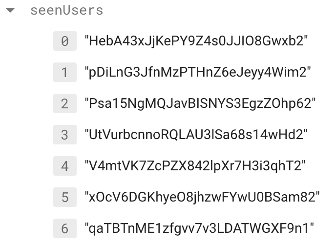{width="3.9130708661417324in"
height="2.8407392825896762in"}

The list of seen users

## Added interests causing overflow

In the home page, we display each user's interests on their profile
card. With the addition of more interests to accommodate more user
interests, there is **a possibility of overflow if all interests are
selected** which causes the profile card to allocate a huge amount of
space to place all the interests. We simply decided to limit the number
of interests shown in the home page to improve the user interface. We
only show the first 4 interests on the home page, but their full
interests can still be seen in their profile info by the user they have
swiped right on.

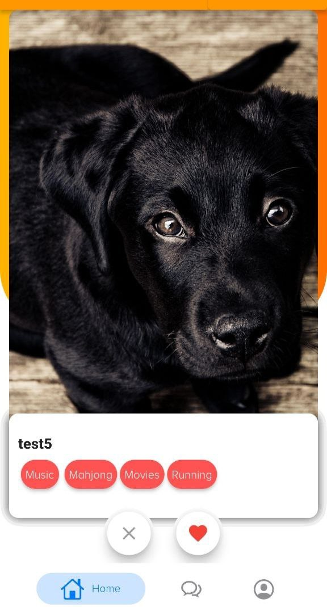{width="3.0833333333333335in"
height="5.298176946631671in"}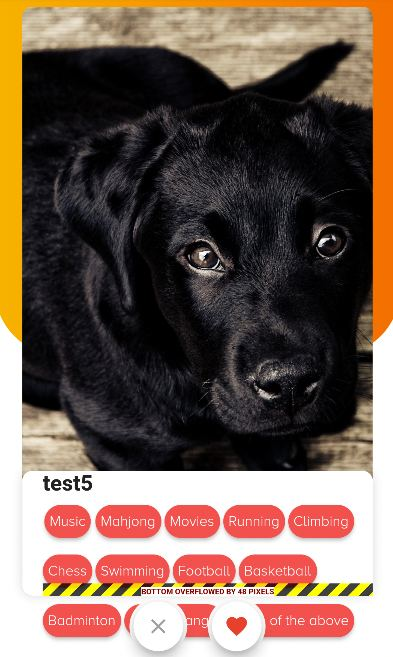{width="2.994792213473316in"
height="5.006560586176728in"}

Overflow due to too many interests

## Automated Testing 

When writing our test cases for automated testing, we encountered
difficulty in getting tests cases to run correctly, and it would almost
always return in failure, with the screen turning black before it loads
the next screen correctly, even though testing it manually would
demonstrate that our app does, indeed, work as intended. This was
puzzling to us and it was difficult to tell whether it was an error in
the test cases that were written or it was a bug in our program. **Our
initial diagnosis was that the package we used was unable to track
navigations made by the user, however, this was proven false once we did
more research and looked at more online guides**.

After some time of trying out methods in the package, we realised that
by implementing a manual gap of a few seconds, the test almost always
passes and the dialog we anticipated will load correctly. This bug was
extremely elusive as there were not much signs we had to accurately
diagnose the origin of the bug, and **due to us always carrying out
manual testing, we did not account for the time required for backend
processes to take place before seeing the dialog.** However, when the
machine input the fields automatically, there was a noticeable pause
before the dialog is shown, and without the few seconds gap, the
WidgetTester had already determined that it had failed.

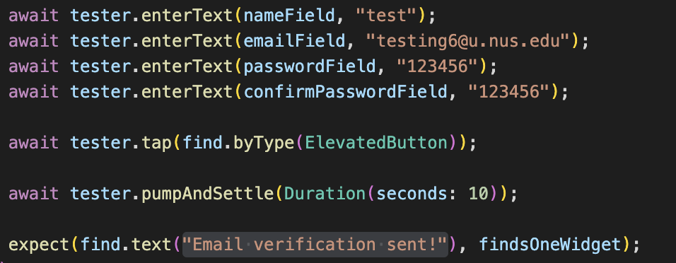{width="6.5in" height="2.5277777777777777in"}

The necessary line of code for the test case to pass.

The above are just 5 of the bugs that we were able to catch and fix by
Milestone 3. Through this, we also realised the **importance of writing
good code**, and communicating in the event where we needed to debug
each other's code. Furthermore, we learnt the **importance of version
control**, to ensure that our main branch is always stable.

# 

# Program Flow

**[Activity Diagram]{.underline}**

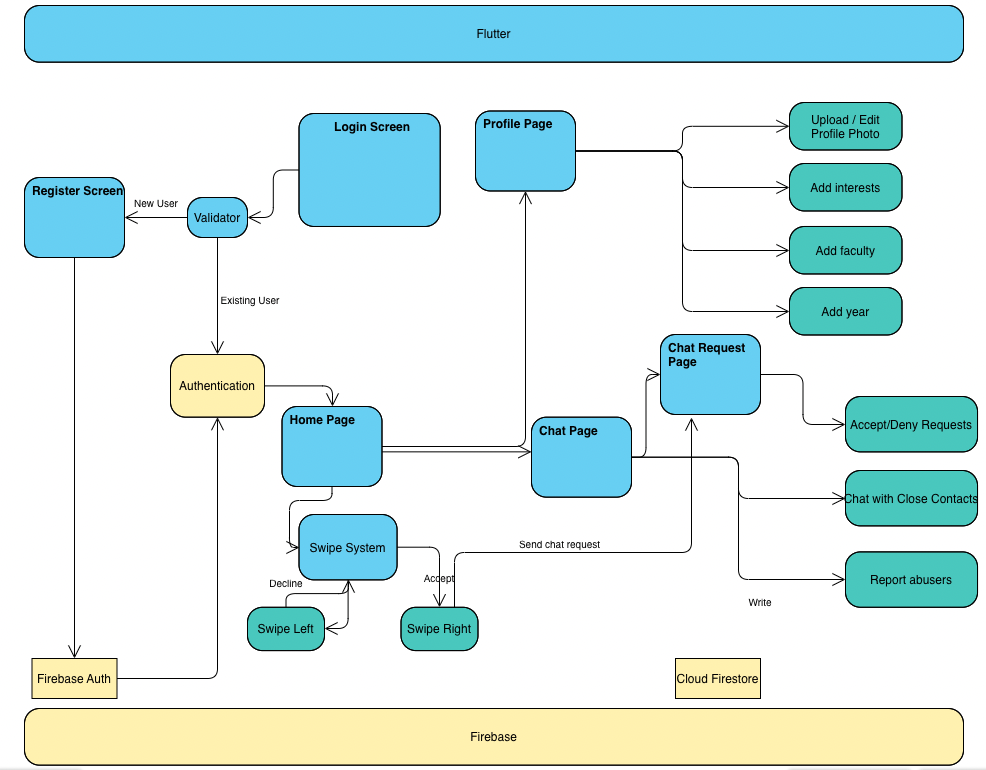{width="6.5in" height="5.069444444444445in"}

The above diagram seeks to provide a brief overview of the interactions
between the components of our app.

Upon opening the app, the user is able to login/register with the
assistance of Firebase Auth. After successfully logging in, the user
will be able to see a **Home Page, with a swiping system**, and also
includes **navigation to other screens including a Profile Page and Chat
Screen**.

The **Home Page** has a Swipe System that **allows the user to swipe
left or right** on the other users registered on the application. After
each swipe, the swipe card is then removed from the stack. This is the
**key feature that allows chat requests to be sent to other users**.

The **Profile Page** has fields that the user can edit, including a
p**rofile photo, a biography box, lists for interests, year as well as
faculty** to select from. This information can then be saved and updated
accordingly.

The **Chat Page** has a list of all the chats that the current user is
in, either due to an outgoing request being accepted, or accepting an
incoming request. **Clicking a particular chat will bring them to a
messaging screen**, where users are able to send messages to each other.
The chat page **also supports navigation to the Chat Requests Screen**,
where all incoming requests are displayed. Accepting this request will
add the respective user as a Close Contact and will show up in the Chat
Page.

**[Flutter Frontend Widget Tree Diagram]{.underline}**

{width="6.5in" height="4.722222222222222in"}

The above diagram is a Flutter Frontend Widget Tree, which shows in
detail all the Flutter widgets that we have made use of during the
development of our application. The frontend components shown here are a
**mixture of Flutter widgets and screens that we have created by using
existing packages or lower level built-in widgets**.

In particular, note that the central component that the application is
built upon is the "Persistent bottom navigation bar", which acts as a
central piece that brings all other screens and widgets together.

For simplicity and clarity, we have chosen to omit low level widgets
such as Text, Buttons, Scaffold etc, and instead seek to convey the
general structure of our frontend layout.

**[Cloud Firestore Backend Tree Diagram]{.underline}**

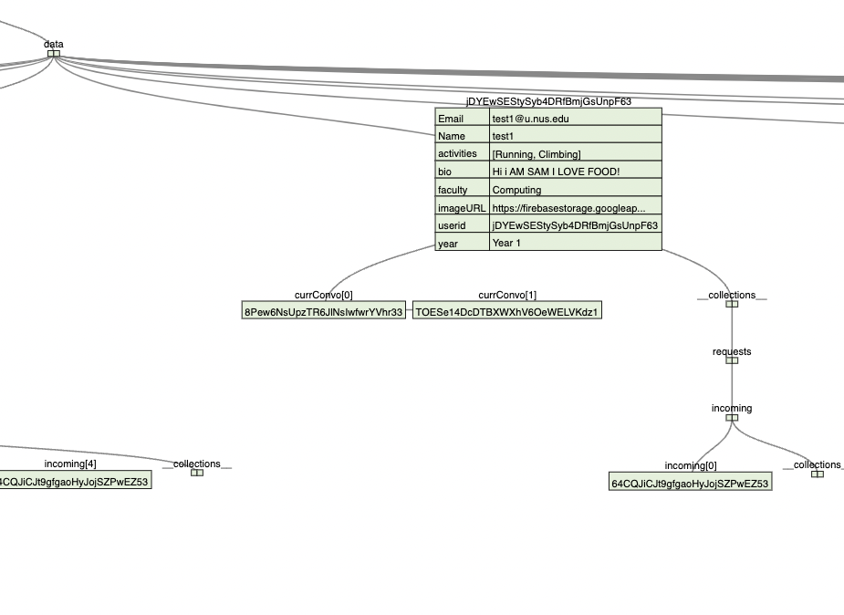{width="6.5in" height="4.736111111111111in"}As
for our backend, we have opted for a **document store, noSQL database**
known as Cloud Firestore. This database makes use of collections, which
can store documents, which can then contain information as fields, or
even sub-collections.

We have exported our collections as JSON due to their similar data
structures, and with the help of a JSON tree visualizer, we have
generated a tree that contains all the documents under the "users"
collection. The above is an example of one of the user documents within
Cloud Firestore.

The root node, **"data", represents the root collection "users"**, and a
line connects between it and a **user document, which contains the
various fields**. Below it, **sub-collections are represented with
"\_collections\_"** and it contains a document "requests", with a field
"incoming".

Through the above diagrams and explanations, we hope that readers are
able to gain some insight on how we coded both the frontend and backend
components, and how they work together to function.

# Quality Assurance

Before implementing new features, we carried out regular testing to
ensure that existing features continue to work well, and that new
features added integrate well with existing features. This is mostly
done in the form of **system testing**, **automated user interface
testing** as well as **user testing**.

## System testing: Smoke Tests, followed by Regression Tests

A set of smoke test cases have been selected from a greater list of
regression test cases. The objective of these smoke tests are to ensure
that major features are not broken according to the user stories it is
intended to achieve.

After smoke tests have been passed, we will carry out the full set of
regression tests, to ensure that the entire system works in its entirety
after implementing the new features.

**[Smoke Tests]{.underline}**

+---+---------+---------+-------------+---------+---------+---------+
| T | Key     | Test    | Steps       | E       | Test    | Date    |
| e | Feature | Ob      |             | xpected | result  | tested  |
| s |         | jective |             | Outcome |         |         |
| t |         |         |             |         |         |         |
| I |         |         |             |         |         |         |
| D |         |         |             |         |         |         |
+---+---------+---------+-------------+---------+---------+---------+
| 1 | R       | Test    | 1\. In the  | User    | PASS    | 24/     |
|   | egister | that a  | register    | can     |         | 07/2022 |
|   | and     | user    | page, key   | succe   |         |         |
|   | Login   | can     | in a name,  | ssfully |         |         |
|   |         | succe   | NUS email   | re      |         |         |
|   |         | ssfully | and a       | gister, |         |         |
|   |         | r       | password.   | see an  |         |         |
|   |         | egister |             | alert   |         |         |
|   |         |         | 2\. Verify  | and     |         |         |
|   |         |         | that an     | receive |         |         |
|   |         |         | alert that  | a       |         |         |
|   |         |         | reads       | verif   |         |         |
|   |         |         | "Email      | ication |         |         |
|   |         |         | v           | email.  |         |         |
|   |         |         | erification |         |         |         |
|   |         |         | sent!"      |         |         |         |
|   |         |         | appears.    |         |         |         |
+---+---------+---------+-------------+---------+---------+---------+
| 4 |         | Test    | 1\. In the  | After   | PASS    | 24/     |
|   |         | that a  | login page, | com     |         | 07/2022 |
|   |         | reg     | key in our  | pleting |         |         |
|   |         | istered | personal    | email   |         |         |
|   |         | user    | NUS email   | verifi  |         |         |
|   |         | can     | as email    | cation, |         |         |
|   |         | succe   | and our     | the     |         |         |
|   |         | ssfully | registered  | user    |         |         |
|   |         | login   | email as    | will be |         |         |
|   |         | after   | password.   | able to |         |         |
|   |         | email   |             | login   |         |         |
|   |         | verif   | 2\. Verify  | to the  |         |         |
|   |         | ication | that we can | appli   |         |         |
|   |         | is      | see the     | cation. |         |         |
|   |         | co      | Home Page   |         |         |         |
|   |         | mplete. | (Swipe      |         |         |         |
|   |         |         | card)       |         |         |         |
+---+---------+---------+-------------+---------+---------+---------+
| 6 | C       | Test    | 1\. Login   | User    | PASS    | 24/     |
|   | reating | that a  | to the      | can     |         | 07/2022 |
|   | and     | user    | application | view    |         |         |
|   | Cust    | can     | and         | their   |         |         |
|   | omizing | n       | navigate to | profile |         |         |
|   | Profile | avigate | the profile | page.   |         |         |
|   |         | to      | page.       |         |         |         |
|   |         | their   |             |         |         |         |
|   |         | profile | 2\. Verify  |         |         |         |
|   |         | page.   | that the    |         |         |         |
|   |         |         | profile     |         |         |         |
|   |         |         | page        |         |         |         |
|   |         |         | renders     |         |         |         |
|   |         |         | correctly.  |         |         |         |
+---+---------+---------+-------------+---------+---------+---------+
| 8 | Request | Test    | 1\. Login   | User is | PASS    | 24/     |
|   | H       | that    | to the      | able to |         | 07/2022 |
|   | andling | upon    | a           | c       |         |         |
|   |         | swiping | pplication, | omplete |         |         |
|   |         | right   | and         | swipe   |         |         |
|   |         | on a    | navigate to | ani     |         |         |
|   |         | user, a | the swipe   | mation, |         |         |
|   |         | chat    | card.       | which   |         |         |
|   |         | request |             | automa  |         |         |
|   |         | is      | 2\. Swipe   | tically |         |         |
|   |         | sent.   | right on a  | sends a |         |         |
|   |         |         | user named  | chat    |         |         |
|   |         |         | "test4".    | request |         |         |
|   |         |         |             | to the  |         |         |
|   |         |         | 3\. Verify  | other   |         |         |
|   |         |         | that this   | user.   |         |         |
|   |         |         | action can  |         |         |         |
|   |         |         | be          |         |         |         |
|   |         |         | completed   |         |         |         |
|   |         |         | su          |         |         |         |
|   |         |         | ccessfully. |         |         |         |
+---+---------+---------+-------------+---------+---------+---------+
| 9 |         | Test    | 1\. After   | User is | PASS    | 24/     |
|   |         | that a  | completing  | able to |         | 07/2022 |
|   |         | user    | the         | view    |         |         |
|   |         | can     | previous    | i       |         |         |
|   |         | view    | test, login | ncoming |         |         |
|   |         | all     | to the      | chat    |         |         |
|   |         | their   | application | re      |         |         |
|   |         | i       | with the    | quests. |         |         |
|   |         | ncoming | email:      |         |         |         |
|   |         | r       | [[test4@u.n |         |         |         |
|   |         | equests | us.edu]{.un |         |         |         |
|   |         | under   | derline}](m |         |         |         |
|   |         | the     | ailto:test4 |         |         |         |
|   |         | Chat    | @u.nus.edu) |         |         |         |
|   |         | R       | and         |         |         |         |
|   |         | equests | password:   |         |         |         |
|   |         | page.   | 123456.     |         |         |         |
|   |         |         |             |         |         |         |
|   |         |         | 2\.         |         |         |         |
|   |         |         | Navigate to |         |         |         |
|   |         |         | the chats   |         |         |         |
|   |         |         | page and    |         |         |         |
|   |         |         | click on    |         |         |         |
|   |         |         | the Chat    |         |         |         |
|   |         |         | requests    |         |         |         |
|   |         |         | button.     |         |         |         |
|   |         |         |             |         |         |         |
|   |         |         | 3\. Verify  |         |         |         |
|   |         |         | that the    |         |         |         |
|   |         |         | chat        |         |         |         |
|   |         |         | requests    |         |         |         |
|   |         |         | page has    |         |         |         |
|   |         |         | updated     |         |         |         |
|   |         |         | correctly.  |         |         |         |
+---+---------+---------+-------------+---------+---------+---------+
| 1 | Matc    | Test    | 1\. Login   | Users   | PASS    | 24/     |
| 2 | hmaking | that a  | to the      | are     |         | 07/2022 |
|   | System  | user    | application | able to |         |         |
|   |         | can     | and         | view    |         |         |
|   |         | view    | navigate to | all     |         |         |
|   |         | other   | the swipe   | other   |         |         |
|   |         | reg     | card.       | reg     |         |         |
|   |         | istered |             | istered |         |         |
|   |         | users   | 2\. Verify  | users   |         |         |
|   |         | on the  | that there  | on the  |         |         |
|   |         | card    | is a swipe  | card    |         |         |
|   |         | stack   | card with a | stack   |         |         |
|   |         |         | user's      | ev      |         |         |
|   |         |         | name,       | erytime |         |         |
|   |         |         | display     | upon    |         |         |
|   |         |         | picture and | login.  |         |         |
|   |         |         | interests   |         |         |         |
|   |         |         | present.    |         |         |         |
+---+---------+---------+-------------+---------+---------+---------+
| 1 |         | Test    | 1\. Login   | Users   | PASS    | 24/     |
| 3 |         | that a  | to the      | are     |         | 07/2022 |
|   |         | user    | application | able to |         |         |
|   |         | can     | and         | make    |         |         |
|   |         | swipe   | navigate to | use of  |         |         |
|   |         | both    | the swipe   | the     |         |         |
|   |         | left    | card.       | swipe   |         |         |
|   |         | and     |             | system  |         |         |
|   |         | right   | 2\. Swipe   | to      |         |         |
|   |         |         | right on    | swipe   |         |         |
|   |         |         | the first   | both    |         |         |
|   |         |         | user.       | right   |         |         |
|   |         |         |             | and     |         |         |
|   |         |         | 3\. Logout, | left.   |         |         |
|   |         |         | then log    |         |         |         |
|   |         |         | back into   |         |         |         |
|   |         |         | the         |         |         |         |
|   |         |         | a           |         |         |         |
|   |         |         | pplication. |         |         |         |
|   |         |         |             |         |         |         |
|   |         |         | 4\. Swipe   |         |         |         |
|   |         |         | left on the |         |         |         |
|   |         |         | next user   |         |         |         |
|   |         |         | again.      |         |         |         |
|   |         |         |             |         |         |         |
|   |         |         | 5\. Verify  |         |         |         |
|   |         |         | that the    |         |         |         |
|   |         |         | action can  |         |         |         |
|   |         |         | be          |         |         |         |
|   |         |         | completed   |         |         |         |
|   |         |         | su          |         |         |         |
|   |         |         | ccessfully. |         |         |         |
+---+---------+---------+-------------+---------+---------+---------+
| 1 | Me      | Test    | 1\. Login   | User    | PASS    | 24/     |
| 5 | ssaging | that    | to the      | can see |         | 07/2022 |
|   | System  | the     | application | all     |         |         |
|   |         | user    | and         | their   |         |         |
|   |         | can     | navigate to | av      |         |         |
|   |         | display | the chats   | ailable |         |         |
|   |         | their   | page.       | chats,  |         |         |
|   |         | current |             | and a   |         |         |
|   |         | chats.  | 2\. Verify  | blank   |         |         |
|   |         |         | that a list | screen  |         |         |
|   |         |         | of current  | if      |         |         |
|   |         |         | users that  | there   |         |         |
|   |         |         | they are    | are no  |         |         |
|   |         |         | chatting    | chats.  |         |         |
|   |         |         | with        |         |         |         |
|   |         |         | appears.    |         |         |         |
+---+---------+---------+-------------+---------+---------+---------+

**[Regression Tests]{.underline}**

+---+----------+---------+-------------+---------+---------+---------+
| T | Key      | Test    | Steps       | E       | Test    | Date    |
| e | Feature  | Ob      |             | xpected | result  | tested  |
| s |          | jective |             | Outcome |         |         |
| t |          |         |             |         |         |         |
| I |          |         |             |         |         |         |
| D |          |         |             |         |         |         |
+---+----------+---------+-------------+---------+---------+---------+
| 1 | Register | Test    | 1\. In the  | User    | PASS    | 24/     |
|   | and      | that a  | register    | can     |         | 07/2022 |
|   | Login    | user    | page, key   | succe   |         |         |
|   |          | can     | in a name,  | ssfully |         |         |
|   |          | succe   | NUS email   | re      |         |         |
|   |          | ssfully | and a       | gister, |         |         |
|   |          | re      | password.   | see an  |         |         |
|   |          | gister. |             | alert   |         |         |
|   |          |         | 2\. Verify  | and     |         |         |
|   |          | (AUT    | that an     | receive |         |         |
|   |          | OMATED) | alert that  | a       |         |         |
|   |          |         | reads       | verif   |         |         |
|   |          |         | "Email      | ication |         |         |
|   |          |         | v           | email.  |         |         |
|   |          |         | erification |         |         |         |
|   |          |         | sent!"      |         |         |         |
|   |          |         | appears.    |         |         |         |
+---+----------+---------+-------------+---------+---------+---------+
| 2 |          | Test    | 1\. In the  | User    | PASS    | 24/     |
|   |          | that a  | register    | will    |         | 07/2022 |
|   |          | user    | page, key   | not be  |         |         |
|   |          | with an | in a name,  | able to |         |         |
|   |          | invalid | an email    | r       |         |         |
|   |          | NUS     | that does   | egister |         |         |
|   |          | email   | not end     | without |         |         |
|   |          | cannot  | with        | an      |         |         |
|   |          | r       | "           | email   |         |         |
|   |          | egister | @u.nus.edu" | ending  |         |         |
|   |          |         |             | with    |         |         |
|   |          |         | 2\. Verify  | "@u.nu  |         |         |
|   |          |         | that the    | s.edu". |         |         |
|   |          |         | form cannot |         |         |         |
|   |          |         | be          |         |         |         |
|   |          |         | submitted.  |         |         |         |
+---+----------+---------+-------------+---------+---------+---------+
| 3 |          | Test    | 1\. In the  | User    | PASS    | 24/     |
|   |          | that a  | register    | will    |         | 07/2022 |
|   |          | user    | page, key   | not be  |         |         |
|   |          | cannot  | in a name,  | able to |         |         |
|   |          | re-r    | an email    | r       |         |         |
|   |          | egister | "[[         | egister |         |         |
|   |          | an      | test4@u.nus | an      |         |         |
|   |          | e       | .edu]{.unde | email   |         |         |
|   |          | xisting | rline}](mai | that    |         |         |
|   |          | email.  | lto:test1@u | already |         |         |
|   |          |         | .nus.edu)", | exists  |         |         |
|   |          |         | and a       | in the  |         |         |
|   |          |         | password.   | da      |         |         |
|   |          |         |             | tabase. |         |         |
|   |          |         | 2\. Verify  |         |         |         |
|   |          |         | that an     |         |         |         |
|   |          |         | alert that  |         |         |         |
|   |          |         | reads       |         |         |         |
|   |          |         | "Failed to  |         |         |         |
|   |          |         | add user:   |         |         |         |
|   |          |         | Account     |         |         |         |
|   |          |         | already     |         |         |         |
|   |          |         | exists!"    |         |         |         |
|   |          |         | appears.    |         |         |         |
+---+----------+---------+-------------+---------+---------+---------+
| 4 |          | Test    | 1\. In the  | After   | PASS    | 24/     |
|   |          | that a  | login page, | com     |         | 07/2022 |
|   |          | reg     | key in our  | pleting |         |         |
|   |          | istered | personal    | email   |         |         |
|   |          | user    | NUS email   | verifi  |         |         |
|   |          | can     | as email    | cation, |         |         |
|   |          | succe   | and our     | the     |         |         |
|   |          | ssfully | registered  | user    |         |         |
|   |          | login   | email as    | will be |         |         |
|   |          | after   | password.   | able to |         |         |
|   |          | email   |             | login   |         |         |
|   |          | verif   | 2\. Verify  | to the  |         |         |
|   |          | ication | that we can | appli   |         |         |
|   |          | is      | see the     | cation. |         |         |
|   |          | co      | Home Page   |         |         |         |
|   |          | mplete. | (Swipe      |         |         |         |
|   |          |         | card)       |         |         |         |
|   |          | (AUT    |             |         |         |         |
|   |          | OMATED) |             |         |         |         |
+---+----------+---------+-------------+---------+---------+---------+
| 5 | Password | Test    | 1\. In the  | After   | PASS    | 24/     |
|   | Reset    | that a  | login page, | req     |         | 07/2022 |
|   |          | user    | click on    | uesting |         |         |
|   |          | can     | the "Forgot | to      |         |         |
|   |          | reset   | Password"   | reset   |         |         |
|   |          | their   | button.     | the     |         |         |
|   |          | pa      |             | p       |         |         |
|   |          | ssword. | 2\. Key in  | assword |         |         |
|   |          |         | a           | to an   |         |         |
|   |          | (AUT    | registered  | a       |         |         |
|   |          | OMATED) | NUS email.  | ccount, |         |         |
|   |          |         |             | an      |         |         |
|   |          |         | 3\. Verify  | alert   |         |         |
|   |          |         | that an     | a       |         |         |
|   |          |         | alert       | ppears, |         |         |
|   |          |         | appears.    | sig     |         |         |
|   |          |         |             | nifying |         |         |
|   |          |         |             | that a  |         |         |
|   |          |         |             | p       |         |         |
|   |          |         |             | assword |         |         |
|   |          |         |             | reset   |         |         |
|   |          |         |             | email   |         |         |
|   |          |         |             | has     |         |         |
|   |          |         |             | been    |         |         |
|   |          |         |             | sent.   |         |         |
+---+----------+---------+-------------+---------+---------+---------+
| 6 | Creating | Test    | 1\. Login   | User    | PASS    | 24/     |
|   | and      | that a  | to the      | can     |         | 07/2022 |
|   | Cus      | user    | application | view    |         |         |
|   | tomizing | can     | and         | their   |         |         |
|   | Profile  | n       | navigate to | profile |         |         |
|   |          | avigate | the profile | page.   |         |         |
|   |          | to      | page.       |         |         |         |
|   |          | their   |             |         |         |         |
|   |          | profile | 2\. Verify  |         |         |         |
|   |          | page.   | that the    |         |         |         |
|   |          |         | profile     |         |         |         |
|   |          |         | page        |         |         |         |
|   |          |         | renders     |         |         |         |
|   |          |         | correctly.  |         |         |         |
+---+----------+---------+-------------+---------+---------+---------+
| 7 |          | Test    | 1\. Login   | User    | PASS    | 24/     |
|   |          | that a  | to the      | can     |         | 07/2022 |
|   |          | user    | a           | edit    |         |         |
|   |          | can     | pplication, | and     |         |         |
|   |          | select  | and         | save    |         |         |
|   |          | their   | navigate to | the     |         |         |
|   |          | bio,    | the profile | fields  |         |         |
|   |          | int     | page.       | on      |         |         |
|   |          | erested |             | their   |         |         |
|   |          | acti    | 2\. Under   | profile |         |         |
|   |          | vities, | the bio     | page.   |         |         |
|   |          | f       | section,    |         |         |         |
|   |          | aculty, | edit the    |         |         |         |
|   |          | year of | box into a  |         |         |         |
|   |          | study,  | custom bio. |         |         |         |
|   |          | display |             |         |         |         |
|   |          | photo   | 3\. Under   |         |         |         |
|   |          | and the | the         |         |         |         |
|   |          | info is | interests   |         |         |         |
|   |          | saved.  | section,    |         |         |         |
|   |          |         | select      |         |         |         |
|   |          |         | certain     |         |         |         |
|   |          |         | interests   |         |         |         |
|   |          |         | that are    |         |         |         |
|   |          |         | not the     |         |         |         |
|   |          |         | default     |         |         |         |
|   |          |         | values.     |         |         |         |
|   |          |         |             |         |         |         |
|   |          |         | 4\. Under   |         |         |         |
|   |          |         | the faculty |         |         |         |
|   |          |         | section,    |         |         |         |
|   |          |         | select a    |         |         |         |
|   |          |         | different   |         |         |         |
|   |          |         | faculty.    |         |         |         |
|   |          |         |             |         |         |         |
|   |          |         | 5\. Under   |         |         |         |
|   |          |         | the year    |         |         |         |
|   |          |         | section,    |         |         |         |
|   |          |         | select a    |         |         |         |
|   |          |         | different   |         |         |         |
|   |          |         | year.       |         |         |         |
|   |          |         |             |         |         |         |
|   |          |         | 6\. Click   |         |         |         |
|   |          |         | the red     |         |         |         |
|   |          |         | camera      |         |         |         |
|   |          |         | button to   |         |         |         |
|   |          |         | choose a    |         |         |         |
|   |          |         | different   |         |         |         |
|   |          |         | photo.      |         |         |         |
|   |          |         |             |         |         |         |
|   |          |         | 7\. Click   |         |         |         |
|   |          |         | "Save       |         |         |         |
|   |          |         | info".      |         |         |         |
|   |          |         |             |         |         |         |
|   |          |         | 8\. Logout  |         |         |         |
|   |          |         | and log     |         |         |         |
|   |          |         | back in and |         |         |         |
|   |          |         | verify the  |         |         |         |
|   |          |         | new         |         |         |         |
|   |          |         | information |         |         |         |
|   |          |         | has been    |         |         |         |
|   |          |         | saved.      |         |         |         |
+---+----------+---------+-------------+---------+---------+---------+
| 8 | Request  | Test    | 1\. Login   | User is | PASS    | 24/     |
|   | Handling | that    | to the      | able to |         | 07/2022 |
|   |          | upon    | a           | c       |         |         |
|   |          | swiping | pplication, | omplete |         |         |
|   |          | right   | and         | swipe   |         |         |
|   |          | on a    | navigate to | ani     |         |         |
|   |          | user, a | the swipe   | mation, |         |         |
|   |          | chat    | card.       | which   |         |         |
|   |          | request |             | automa  |         |         |
|   |          | is      | 2\. Swipe   | tically |         |         |
|   |          | sent.   | right on a  | sends a |         |         |
|   |          |         | user named  | chat    |         |         |
|   |          |         | "test4".    | request |         |         |
|   |          |         |             | to the  |         |         |
|   |          |         | 3\. Verify  | other   |         |         |
|   |          |         | that this   | user.   |         |         |
|   |          |         | action can  |         |         |         |
|   |          |         | be          |         |         |         |
|   |          |         | completed   |         |         |         |
|   |          |         | su          |         |         |         |
|   |          |         | ccessfully. |         |         |         |
+---+----------+---------+-------------+---------+---------+---------+
| 9 |          | Test    | 1\. After   | User is | PASS    | 24/     |
|   |          | that a  | completing  | able to |         | 07/2022 |
|   |          | user    | the         | view    |         |         |
|   |          | can     | previous    | i       |         |         |
|   |          | view    | test, login | ncoming |         |         |
|   |          | all     | to the      | chat    |         |         |
|   |          | their   | application | re      |         |         |
|   |          | i       | with the    | quests. |         |         |
|   |          | ncoming | email:      |         |         |         |
|   |          | r       | [[test4@u.n |         |         |         |
|   |          | equests | us.edu]{.un |         |         |         |
|   |          | under   | derline}](m |         |         |         |
|   |          | the     | ailto:test4 |         |         |         |
|   |          | Chat    | @u.nus.edu) |         |         |         |
|   |          | R       | and         |         |         |         |
|   |          | equests | password:   |         |         |         |
|   |          | page.   | 123456.     |         |         |         |
|   |          |         |             |         |         |         |
|   |          |         | 2\.         |         |         |         |
|   |          |         | Navigate to |         |         |         |
|   |          |         | the chats   |         |         |         |
|   |          |         | page and    |         |         |         |
|   |          |         | click on    |         |         |         |
|   |          |         | the Chat    |         |         |         |
|   |          |         | requests    |         |         |         |
|   |          |         | button.     |         |         |         |
|   |          |         |             |         |         |         |
|   |          |         | 3\. Verify  |         |         |         |
|   |          |         | that the    |         |         |         |
|   |          |         | chat        |         |         |         |
|   |          |         | requests    |         |         |         |
|   |          |         | page has    |         |         |         |
|   |          |         | updated     |         |         |         |
|   |          |         | correctly.  |         |         |         |
+---+----------+---------+-------------+---------+---------+---------+
| 1 |          | Test    | 1\. Login   | User is | FAIL    | 24/     |
| 0 |          | that a  | to the      | able to |         | 07/2022 |
|   |          | user    | application | accept  | (In the |         |
|   |          | can     | with the    | i       | event   |         |
|   |          | accept/ | email:      | ncoming | that    |         |
|   |          | decline | [[test4@u.n | chat    | someone |         |
|   |          | their   | us.edu]{.un | re      | accepts |         |
|   |          | i       | derline}](m | quests. | the     |         |
|   |          | ncoming | ailto:test4 |         | user's  |         |
|   |          | chat    | @u.nus.edu) |         | o       |         |
|   |          | r       | and         |         | utgoing |         |
|   |          | equests | password:   |         | chat    |         |
|   |          |         | 123456.     |         | request |         |
|   |          |         |             |         | while   |         |
|   |          |         | 2\.         |         | the     |         |
|   |          |         | Navigate to |         | user is |         |
|   |          |         | the chats   |         | at the  |         |
|   |          |         | page and    |         | chat    |         |
|   |          |         | click on    |         | home    |         |
|   |          |         | the Chat    |         | page,   |         |
|   |          |         | requests    |         | there   |         |
|   |          |         | button.     |         | is a    |         |
|   |          |         |             |         | chance  |         |
|   |          |         | 3\. Click   |         | that    |         |
|   |          |         | on an       |         | the     |         |
|   |          |         | existing    |         | chat    |         |
|   |          |         | request.    |         | shows   |         |
|   |          |         |             |         | up      |         |
|   |          |         | 4\. Press   |         | incorr  |         |
|   |          |         | the "+"     |         | ectly.) |         |
|   |          |         | icon.       |         | This is |         |
|   |          |         |             |         | one of  |         |
|   |          |         | 5\. Verify  |         | the     |         |
|   |          |         | that upon   |         | bugs we |         |
|   |          |         | accepting,  |         | were    |         |
|   |          |         | the chat    |         | unable  |         |
|   |          |         | request     |         | to fix  |         |
|   |          |         | disappears. |         | re      |         |
|   |          |         |             |         | garding |         |
|   |          |         |             |         | r       |         |
|   |          |         |             |         | ealtime |         |
|   |          |         |             |         | u       |         |
|   |          |         |             |         | pdates. |         |
+---+----------+---------+-------------+---------+---------+---------+
| ~ |          | ~~Test  | ~~1. Login  | ~~Users | ~       | ~~24/06 |
| ~ |          | that    | to the      | will    | ~PASS~~ | /2022~~ |
| 1 |          | there   | application | not     |         |         |
| 1 |          | will    | and         | receive |         |         |
| ~ |          | not be  | navigate to | du      |         |         |
| ~ |          | du      | the swipe   | plicate |         |         |
|   |          | plicate | card.~~     | chat    |         |         |
|   |          | requ    |             | r       |         |         |
|   |          | ests.~~ | ~~2. Swipe  | equests |         |         |
|   |          |         | right on    | from    |         |         |
|   |          | This    | the user    | users   |         |         |
|   |          | test is | "test4".~~  | that    |         |         |
|   |          | no      |             | swipe   |         |         |
|   |          | longer  | ~~3.        | right   |         |         |
|   |          | re      | Logout~~    | m       |         |         |
|   |          | quired, |             | ultiple |         |         |
|   |          | since   | ~~4. Repeat | times   |         |         |
|   |          | each    | steps       | on the  |         |         |
|   |          | user    | 1-3.~~      | same    |         |         |
|   |          | will    |             | pe      |         |         |
|   |          | only be | ~~5. Login  | rson.~~ |         |         |
|   |          | able to | to the      |         |         |         |
|   |          | swipe   | application |         |         |         |
|   |          | once on | with the    |         |         |         |
|   |          | every   | email:      |         |         |         |
|   |          | other   | [[test4@u.n |         |         |         |
|   |          | user in | us.edu]{.un |         |         |         |
|   |          | the     | derline}](m |         |         |         |
|   |          | da      | ailto:test4 |         |         |         |
|   |          | tabase. | @u.nus.edu) |         |         |         |
|   |          |         | and         |         |         |         |
|   |          |         | password:   |         |         |         |
|   |          |         | 123456.~~   |         |         |         |
|   |          |         |             |         |         |         |
|   |          |         | ~~6.        |         |         |         |
|   |          |         | Navigate to |         |         |         |
|   |          |         | the chats   |         |         |         |
|   |          |         | page and    |         |         |         |
|   |          |         | click on    |         |         |         |
|   |          |         | the Chat    |         |         |         |
|   |          |         | requests    |         |         |         |
|   |          |         | button.~~   |         |         |         |
|   |          |         |             |         |         |         |
|   |          |         | ~~7. Verify |         |         |         |
|   |          |         | that there  |         |         |         |
|   |          |         | are no      |         |         |         |
|   |          |         | duplicate   |         |         |         |
|   |          |         | incoming    |         |         |         |
|   |          |         | requests.~~ |         |         |         |
+---+----------+---------+-------------+---------+---------+---------+
| 1 | Mat      | Test    | 1\. Login   | Users   | PASS    | 24/     |
| 1 | chmaking | that a  | to the      | are     |         | 07/2022 |
|   | System   | user    | application | able to |         |         |
|   |          | can     | and         | view    |         |         |
|   |          | view    | navigate to | all     |         |         |
|   |          | other   | the swipe   | other   |         |         |
|   |          | reg     | card.       | reg     |         |         |
|   |          | istered |             | istered |         |         |
|   |          | users   | 2\. Verify  | users   |         |         |
|   |          | on the  | that there  | on the  |         |         |
|   |          | card    | is a swipe  | card    |         |         |
|   |          | stack   | card with a | stack   |         |         |
|   |          |         | user's      | ev      |         |         |
|   |          |         | name,       | erytime |         |         |
|   |          |         | display     | upon    |         |         |
|   |          |         | picture and | login.  |         |         |
|   |          |         | interests   |         |         |         |
|   |          |         | present.    |         |         |         |
+---+----------+---------+-------------+---------+---------+---------+
| 1 |          | Test    | 1\. Login   | Users   | PASS    | 24/     |
| 2 |          | that a  | to the      | are     |         | 07/2022 |
|   |          | user    | application | able to |         |         |
|   |          | can     | and         | make    |         |         |
|   |          | swipe   | navigate to | use of  |         |         |
|   |          | both    | the swipe   | the     |         |         |
|   |          | left    | card.       | swipe   |         |         |
|   |          | and     |             | system  |         |         |
|   |          | right   | 2\. Swipe   | to      |         |         |
|   |          |         | right on    | swipe   |         |         |
|   |          |         | the first   | both    |         |         |
|   |          |         | user.       | right   |         |         |
|   |          |         |             | and     |         |         |
|   |          |         | 3\. Logout, | left.   |         |         |
|   |          |         | then log    |         |         |         |
|   |          |         | back into   |         |         |         |
|   |          |         | the         |         |         |         |
|   |          |         | a           |         |         |         |
|   |          |         | pplication. |         |         |         |
|   |          |         |             |         |         |         |
|   |          |         | 4\. Swipe   |         |         |         |
|   |          |         | left on the |         |         |         |
|   |          |         | first user  |         |         |         |
|   |          |         | again.      |         |         |         |
|   |          |         |             |         |         |         |
|   |          |         | 5\. Verify  |         |         |         |
|   |          |         | that the    |         |         |         |
|   |          |         | action can  |         |         |         |
|   |          |         | be          |         |         |         |
|   |          |         | completed   |         |         |         |
|   |          |         | su          |         |         |         |
|   |          |         | ccessfully. |         |         |         |
+---+----------+---------+-------------+---------+---------+---------+
| 1 |          | Test    | 1\. Login   | A user  | PASS    | 24/     |
| 3 |          | that a  | to the      | with    |         | 07/2022 |
|   |          | user    | application | inc     |         |         |
|   |          | cannot  | with an     | omplete |         |         |
|   |          | swipe   | email:      | fields  |         |         |
|   |          | while   | "[i         | will    |         |         |
|   |          | not     | ncomplete@u | not be  |         |         |
|   |          | having  | .nus.edu]{. | allowed |         |         |
|   |          | co      | underline}" | to      |         |         |
|   |          | mpleted | and a       | swipe.  |         |         |
|   |          | their   | password:   |         |         |         |
|   |          | p       | "123456".   |         |         |         |
|   |          | rofile. |             |         |         |         |
|   |          |         | 2\.         |         |         |         |
|   |          |         | Navigate to |         |         |         |
|   |          |         | the swipe   |         |         |         |
|   |          |         | card.       |         |         |         |
|   |          |         |             |         |         |         |
|   |          |         | 3\. Try to  |         |         |         |
|   |          |         | swipe right |         |         |         |
|   |          |         | on the      |         |         |         |
|   |          |         | first user. |         |         |         |
|   |          |         |             |         |         |         |
|   |          |         | 4\. Verify  |         |         |         |
|   |          |         | that an     |         |         |         |
|   |          |         | alert that  |         |         |         |
|   |          |         | reads       |         |         |         |
|   |          |         | "Please     |         |         |         |
|   |          |         | complete    |         |         |         |
|   |          |         | your        |         |         |         |
|   |          |         | profile     |         |         |         |
|   |          |         | before      |         |         |         |
|   |          |         | swiping!    |         |         |         |
|   |          |         |             |         |         |         |
|   |          |         | " pops up.  |         |         |         |
|   |          |         |             |         |         |         |
|   |          |         | 5\. Repeat  |         |         |         |
|   |          |         | steps 3 and |         |         |         |
|   |          |         | 4 while     |         |         |         |
|   |          |         | swiping     |         |         |         |
|   |          |         | left.       |         |         |         |
+---+----------+---------+-------------+---------+---------+---------+
| 1 |          | Test    | 1\. Login   | User    | PASS    | 2       |
| 4 |          | that a  | to the      | can     |         | 4/07/22 |
|   |          | user    | application | only    |         |         |
|   |          | will    | and         | swipe   |         |         |
|   |          | not see | navigate to | once on |         |         |
|   |          | the     | the swipe   | another |         |         |
|   |          | same    | card.       | user.   |         |         |
|   |          | user    |             |         |         |         |
|   |          | after   | 2\. Swipe   |         |         |         |
|   |          | swiping | left on the |         |         |         |
|   |          | on      | first user. |         |         |         |
|   |          | them.   |             |         |         |         |
|   |          |         | 3\. Logout, |         |         |         |
|   |          |         | then log    |         |         |         |
|   |          |         | back in.    |         |         |         |
|   |          |         |             |         |         |         |
|   |          |         | 4\. Without |         |         |         |
|   |          |         | changing    |         |         |         |
|   |          |         | any         |         |         |         |
|   |          |         | settings,   |         |         |         |
|   |          |         | verify that |         |         |         |
|   |          |         | the user    |         |         |         |
|   |          |         | previously  |         |         |         |
|   |          |         | swiped on   |         |         |         |
|   |          |         | no longer   |         |         |         |
|   |          |         | shows up on |         |         |         |
|   |          |         | the swipe   |         |         |         |
|   |          |         | card.       |         |         |         |
+---+----------+---------+-------------+---------+---------+---------+
| 1 | M        | Test    | 1\. Login   | User    | PASS    | 24/     |
| 5 | essaging | that    | to the      | can see |         | 07/2022 |
|   | System   | the     | application | all     |         |         |
|   |          | user    | and         | their   |         |         |
|   |          | can     | navigate to | av      |         |         |
|   |          | display | the chats   | ailable |         |         |
|   |          | their   | page.       | chats,  |         |         |
|   |          | current |             | and a   |         |         |
|   |          | chats.  | 2\. Verify  | blank   |         |         |
|   |          |         | that a list | screen  |         |         |
|   |          |         | of current  | if      |         |         |
|   |          |         | users that  | there   |         |         |
|   |          |         | they are    | are no  |         |         |
|   |          |         | chatting    | chats.  |         |         |
|   |          |         | with        |         |         |         |
|   |          |         | appears.    |         |         |         |
+---+----------+---------+-------------+---------+---------+---------+
| 1 |          | Test    | 1\. Login   | User    | PASS    | 24/     |
| 6 |          | that    | to the      | can     |         | 07/2022 |
|   |          | upon    | application | accept  |         |         |
|   |          | ac      | and         | an      |         |         |
|   |          | cepting | navigate to | i       |         |         |
|   |          | another | the chats   | ncoming |         |         |
|   |          | user's  | page.       | request |         |         |
|   |          | chat    |             | and     |         |         |
|   |          | r       | 2\. Click   | view    |         |         |
|   |          | equest, | on the Chat | the     |         |         |
|   |          | they    | requests    | changes |         |         |
|   |          | appear  | button.     | in      |         |         |
|   |          | on the  |             | their   |         |         |
|   |          | chats   | 3\. Click   | chats   |         |         |
|   |          | page.   | on an       | page.   |         |         |
|   |          |         | existing    |         |         |         |
|   |          |         | request.    |         |         |         |
|   |          |         |             |         |         |         |
|   |          |         | 4\. Press   |         |         |         |
|   |          |         | the "+"     |         |         |         |
|   |          |         | icon.       |         |         |         |
|   |          |         |             |         |         |         |
|   |          |         | 4\.         |         |         |         |
|   |          |         | Navigate to |         |         |         |
|   |          |         | the chats   |         |         |         |
|   |          |         | page.       |         |         |         |
|   |          |         |             |         |         |         |
|   |          |         | 5\. Verify  |         |         |         |
|   |          |         | that the    |         |         |         |
|   |          |         | chats page  |         |         |         |
|   |          |         | is updated  |         |         |         |
|   |          |         | to show the |         |         |         |
|   |          |         | accepted    |         |         |         |
|   |          |         | user.       |         |         |         |
+---+----------+---------+-------------+---------+---------+---------+
| 1 |          | Test    | 1\. Login   | User    | PASS    | 24/     |
| 7 |          | that    | to the      | can     |         | 07/2022 |
|   |          | p       | application | view    |         |         |
|   |          | revious | and         | m       |         |         |
|   |          | m       | navigate to | essages |         |         |
|   |          | essages | the chats   | that    |         |         |
|   |          | can be  | page.       | have    |         |         |
|   |          | ret     |             | been    |         |         |
|   |          | rieved. | 2\. Click   | sent    |         |         |
|   |          |         | on an       | prev    |         |         |
|   |          |         | existing    | iously. |         |         |
|   |          |         | chat.       |         |         |         |
|   |          |         |             |         |         |         |
|   |          |         | 3\. Verify  |         |         |         |
|   |          |         | that        |         |         |         |
|   |          |         | previous    |         |         |         |
|   |          |         | messages    |         |         |         |
|   |          |         | exchanged   |         |         |         |
|   |          |         | appear.     |         |         |         |
+---+----------+---------+-------------+---------+---------+---------+
| 1 |          | Test    | **This test | User    | PASS    | 24/     |
| 8 |          | that    | requires    | can     |         | 06/2022 |
|   |          | m       | the         | make    |         |         |
|   |          | essages | assistance  | use of  |         |         |
|   |          | can be  | of an       | the     |         |         |
|   |          | sent    | additional  | me      |         |         |
|   |          | and     | user.**     | ssaging |         |         |
|   |          | r       |             | system  |         |         |
|   |          | eceived | 1\. Both    | to chat |         |         |
|   |          | in real | users to    | in real |         |         |
|   |          | time.   | login to    | time.   |         |         |
|   |          |         | the         |         |         |         |
|   |          |         | application |         |         |         |
|   |          |         | and         |         |         |         |
|   |          |         | navigate to |         |         |         |
|   |          |         | the chats   |         |         |         |
|   |          |         | page.       |         |         |         |
|   |          |         |             |         |         |         |
|   |          |         | 2\. Click   |         |         |         |
|   |          |         | on each     |         |         |         |
|   |          |         | other as an |         |         |         |
|   |          |         | existing    |         |         |         |
|   |          |         | chat.       |         |         |         |
|   |          |         |             |         |         |         |
|   |          |         | 3\. Verify  |         |         |         |
|   |          |         | that        |         |         |         |
|   |          |         | messages    |         |         |         |
|   |          |         | can be sent |         |         |         |
|   |          |         | and         |         |         |         |
|   |          |         | received by |         |         |         |
|   |          |         | both users. |         |         |         |
+---+----------+---------+-------------+---------+---------+---------+
| 1 | Filter   | Test    | 1\. Login   | Users   | PASS    | 24/     |
| 9 | System   | that    | to the      | can     |         | 07/2022 |
|   |          | Users   | application | click   |         |         |
|   |          | can set | and         | on      |         |         |
|   |          | basic   | navigate to | buttons |         |         |
|   |          | f       | the profile | that    |         |         |
|   |          | ilters. | page.       | set     |         |         |
|   |          |         |             | their   |         |         |
|   |          |         | 2\. Scroll  | prefe   |         |         |
|   |          |         | to the      | rences. |         |         |
|   |          |         | bottom and  |         |         |         |
|   |          |         | click on    |         |         |         |
|   |          |         | "Set Your   |         |         |         |
|   |          |         | Pr          |         |         |         |
|   |          |         | eferences". |         |         |         |
|   |          |         |             |         |         |         |
|   |          |         | 3\. Verify  |         |         |         |
|   |          |         | click on    |         |         |         |
|   |          |         | buttons on  |         |         |         |
|   |          |         | the filter  |         |         |         |
|   |          |         | screen      |         |         |         |
|   |          |         | turns the   |         |         |         |
|   |          |         | colour from |         |         |         |
|   |          |         | orange to   |         |         |         |
|   |          |         | grey and    |         |         |         |
|   |          |         | vice versa. |         |         |         |
+---+----------+---------+-------------+---------+---------+---------+
| 2 |          | Test    | 1\. Login   | Users   | PASS    | 24/     |
| 0 |          | that    | to the      | can set |         | 07/2022 |
|   |          | upon    | application | their   |         |         |
|   |          | u       | and         | pref    |         |         |
|   |          | pdating | navigate to | erences |         |         |
|   |          | the     | the profile | and     |         |         |
|   |          | f       | page.       | view    |         |         |
|   |          | ilters, |             | the     |         |         |
|   |          | the     | 2\. Scroll  | corres  |         |         |
|   |          | swipe   | to the      | ponding |         |         |
|   |          | card    | bottom and  | changes |         |         |
|   |          | changes | click on    | to the  |         |         |
|   |          | acco    | "Set Your   | swipe   |         |         |
|   |          | rdingly | Pr          | card.   |         |         |
|   |          |         | eferences". |         |         |         |
|   |          |         |             |         |         |         |
|   |          |         | 3\. Ensure  |         |         |         |
|   |          |         | that all    |         |         |         |
|   |          |         | the buttons |         |         |         |
|   |          |         | are         |         |         |         |
|   |          |         | selected    |         |         |         |
|   |          |         | (orange).   |         |         |         |
|   |          |         |             |         |         |         |
|   |          |         | 4\.         |         |         |         |
|   |          |         | Alternate   |         |         |         |
|   |          |         | between     |         |         |         |
|   |          |         | D           |         |         |         |
|   |          |         | e-selecting |         |         |         |
|   |          |         | Male and    |         |         |         |
|   |          |         | Female      |         |         |         |
|   |          |         | under the   |         |         |         |
|   |          |         | Gender      |         |         |         |
|   |          |         | category,   |         |         |         |
|   |          |         | and click   |         |         |         |
|   |          |         | on "Save    |         |         |         |
|   |          |         | Info".      |         |         |         |
|   |          |         |             |         |         |         |
|   |          |         | 5\.         |         |         |         |
|   |          |         | Navigate to |         |         |         |
|   |          |         | the swipe   |         |         |         |
|   |          |         | card.       |         |         |         |
|   |          |         |             |         |         |         |
|   |          |         | 6\. Verify  |         |         |         |
|   |          |         | that the    |         |         |         |
|   |          |         | swipe card  |         |         |         |
|   |          |         | has changed |         |         |         |
|   |          |         | after each  |         |         |         |
|   |          |         | selection.  |         |         |         |
+---+----------+---------+-------------+---------+---------+---------+
| 2 |          | Test    | 1\. Login   | Users   | PASS    | 24/     |
| 1 |          | that    | to the      | will    |         | 07/2022 |
|   |          | empty   | application | need to |         |         |
|   |          | sel     | and         | select  |         |         |
|   |          | ections | navigate to | at      |         |         |
|   |          | for any | the profile | least   |         |         |
|   |          | one     | page.       | one     |         |         |
|   |          | c       |             | option  |         |         |
|   |          | ategory | 2\. Scroll  | from    |         |         |
|   |          | will    | to the      | each    |         |         |
|   |          | result  | bottom and  | c       |         |         |
|   |          | in an   | click on    | ategory |         |         |
|   |          | empty   | "Set Your   | in      |         |         |
|   |          | swipe   | Pr          | order   |         |         |
|   |          | card.   | eferences". | to view |         |         |
|   |          |         |             | a valid |         |         |
|   |          |         | 3\.         | swipe   |         |         |
|   |          |         | De-select   | card.   |         |         |
|   |          |         | all the     |         |         |         |
|   |          |         | buttons     |         |         |         |
|   |          |         | under the   |         |         |         |
|   |          |         | "Gender"    |         |         |         |
|   |          |         | Category.   |         |         |         |
|   |          |         |             |         |         |         |
|   |          |         | 4\.         |         |         |         |
|   |          |         | Navigate to |         |         |         |
|   |          |         | the swipe   |         |         |         |
|   |          |         | card.       |         |         |         |
|   |          |         |             |         |         |         |
|   |          |         | 5\. Verify  |         |         |         |
|   |          |         | that the    |         |         |         |
|   |          |         | swipe card  |         |         |         |
|   |          |         | is now      |         |         |         |
|   |          |         | empty.      |         |         |         |
|   |          |         |             |         |         |         |
|   |          |         | 6\. Repeat  |         |         |         |
|   |          |         | steps 1 to  |         |         |         |
|   |          |         | 5 for each  |         |         |         |
|   |          |         | of the      |         |         |         |
|   |          |         | other       |         |         |         |
|   |          |         | categories. |         |         |         |
+---+----------+---------+-------------+---------+---------+---------+
| 2 | Recomm   | Test    | 1\. Login   | Users   | PASS    | 24/     |
| 2 | endation | that    | to the      | can     |         | 07/2022 |
|   | A        | the     | application | view    |         |         |
|   | lgorithm | recomme | and         | the     |         |         |
|   |          | ndation | navigate to | p       |         |         |
|   |          | al      | the profile | rofiles |         |         |
|   |          | gorithm | page.       | with    |         |         |
|   |          | a       |             | higher  |         |         |
|   |          | rranges | 2\. Select  | "simi   |         |         |
|   |          | the     | all the     | larity" |         |         |
|   |          | swipe   | interests,  | at the  |         |         |
|   |          | card in | and click   | front   |         |         |
|   |          | order   | "Save       | of the  |         |         |
|   |          | of      | Info".      | swipe   |         |         |
|   |          | "simi   |             | card.   |         |         |
|   |          | larity" | 3\.         |         |         |         |
|   |          |         | Navigate to |         |         |         |
|   |          |         | the swipe   |         |         |         |
|   |          |         | card.       |         |         |         |
|   |          |         |             |         |         |         |
|   |          |         | 4\. For     |         |         |         |
|   |          |         | each user,  |         |         |         |
|   |          |         | take note   |         |         |         |
|   |          |         | of the      |         |         |         |
|   |          |         | number of   |         |         |         |
|   |          |         | interests   |         |         |         |
|   |          |         | displayed,  |         |         |         |
|   |          |         | then swipe. |         |         |         |
|   |          |         |             |         |         |         |
|   |          |         | 5\. Verify  |         |         |         |
|   |          |         | that the    |         |         |         |
|   |          |         | number of   |         |         |         |
|   |          |         | interests   |         |         |         |
|   |          |         | the user    |         |         |         |
|   |          |         | has         |         |         |         |
|   |          |         | decreases.  |         |         |         |
+---+----------+---------+-------------+---------+---------+---------+
| 2 | Feedback | Test    | 1\. Login   | Users   | PASS    | 24/     |
| 3 | System   | that    | to the      | can     |         | 07/2022 |
|   |          | f       | application | send    |         |         |
|   |          | eedback | and         | their   |         |         |
|   |          | and     | navigate to | fe      |         |         |
|   |          | bugs    | the swipe   | edback/ |         |         |
|   |          | can be  | card.       | report  |         |         |
|   |          | re      |             | bugs    |         |         |
|   |          | ported. | 2\. Click   | they    |         |         |
|   |          |         | on "Report  | find on |         |         |
|   |          |         | a bug" on   | the     |         |         |
|   |          |         | the top     | app.    |         |         |
|   |          |         | right hand  |         |         |         |
|   |          |         | corner.     |         |         |         |
|   |          |         |             |         |         |         |
|   |          |         | 3\. Choose  |         |         |         |
|   |          |         | "Bug" from  |         |         |         |
|   |          |         | the drop    |         |         |         |
|   |          |         | down menu,  |         |         |         |
|   |          |         | and enter a |         |         |         |
|   |          |         | d           |         |         |         |
|   |          |         | escription. |         |         |         |
|   |          |         |             |         |         |         |
|   |          |         | 4\. Click   |         |         |         |
|   |          |         | on "Submit  |         |         |         |
|   |          |         | form".      |         |         |         |
|   |          |         |             |         |         |         |
|   |          |         | 5\. Verify  |         |         |         |
|   |          |         | that an     |         |         |         |
|   |          |         | alert that  |         |         |         |
|   |          |         | says "Thank |         |         |         |
|   |          |         | you for     |         |         |         |
|   |          |         | your        |         |         |         |
|   |          |         | feedback!"  |         |         |         |
|   |          |         | appears.    |         |         |         |
|   |          |         |             |         |         |         |
|   |          |         | 6\. Repeat  |         |         |         |
|   |          |         | steps 3 - 6 |         |         |         |
|   |          |         | for each    |         |         |         |
|   |          |         | feedback    |         |         |         |
|   |          |         | category.   |         |         |         |
+---+----------+---------+-------------+---------+---------+---------+
| 2 | Report   | Test    | 1\. Login   | Users   | PASS    | 24/     |
| 4 | Abuse    | that    | to the      | can     |         | 07/2022 |
|   |          | once a  | application | report  |         |         |
|   |          | user    | and         | another |         |         |
|   |          | has     | navigate to | user,   |         |         |
|   |          | been    | the chats   | and     |         |         |
|   |          | re      | page.       | thus    |         |         |
|   |          | ported, |             | start a |         |         |
|   |          | an      | 2\. Click   | c       |         |         |
|   |          | au      | on an       | hatroom |         |         |
|   |          | tomated | existing    | with    |         |         |
|   |          | message | chat.       | the     |         |         |
|   |          | will be |             | admin.  |         |         |
|   |          | sent to | 3\. On the  |         |         |         |
|   |          | the     | top right   |         |         |         |
|   |          | admin   | hand        |         |         |         |
|   |          | in a    | corner,     |         |         |         |
|   |          | chat    | click on    |         |         |         |
|   |          | room.   | the 3 dots. |         |         |         |
|   |          |         |             |         |         |         |
|   |          |         | 4\. Click   |         |         |         |
|   |          |         | on "Report  |         |         |         |
|   |          |         | user" under |         |         |         |
|   |          |         | the         |         |         |         |
|   |          |         | dropdown    |         |         |         |
|   |          |         | menu.       |         |         |         |
|   |          |         |             |         |         |         |
|   |          |         | 5\. Verify  |         |         |         |
|   |          |         | that an     |         |         |         |
|   |          |         | automated   |         |         |         |
|   |          |         | message has |         |         |         |
|   |          |         | been sent   |         |         |         |
|   |          |         | to the      |         |         |         |
|   |          |         | admin in a  |         |         |         |
|   |          |         | chatroom    |         |         |         |
|   |          |         | with the    |         |         |         |
|   |          |         | admin.      |         |         |         |
+---+----------+---------+-------------+---------+---------+---------+
| 2 |          | Test    | 1\. Login   | Users   | FAIL    | 24/     |
| 5 |          | that    | to the      | can     |         | 07/2022 |
|   |          | once a  | application | block   | (After  |         |
|   |          | user    | with the    | another | "Block  |         |
|   |          | has     | email:      | user.   | user"   |         |
|   |          | been    | [[test4@u.n | No      | has     |         |
|   |          | b       | us.edu]{.un | m       | been    |         |
|   |          | locked, | derline}](m | essages | c       |         |
|   |          | m       | ailto:test4 | will be | licked, |         |
|   |          | essages | @u.nus.edu) | allowed | there   |         |
|   |          | cannot  | and         | to be   | is a    |         |
|   |          | be sent | password:   | ex      | chance  |         |
|   |          | or      | 123456 and  | changed | where   |         |
|   |          | re      | navigate to | in the  | m       |         |
|   |          | ceived. | the chats   | event   | essages |         |
|   |          |         | page.       | of such | are     |         |
|   |          |         |             | a       | still   |         |
|   |          |         | 2\. Click   | block.  | allowed |         |
|   |          |         | on the      |         | to be   |         |
|   |          |         | existing    |         | sent by |         |
|   |          |         | chat with   |         | the     |         |
|   |          |         | the user    |         | ini     |         |
|   |          |         | Test2.      |         | tiator. |         |
|   |          |         |             |         | H       |         |
|   |          |         | 3\. On the  |         | owever, |         |
|   |          |         | top right   |         | after   |         |
|   |          |         | hand        |         | rel     |         |
|   |          |         | corner,     |         | oading, |         |
|   |          |         | click on    |         | they    |         |
|   |          |         | the 3 dots. |         | can no  |         |
|   |          |         |             |         | longer  |         |
|   |          |         | 4\. Click   |         | do so)  |         |
|   |          |         | on "Block   |         |         |         |
|   |          |         | user" under |         | This is |         |
|   |          |         | the         |         | another |         |
|   |          |         | dropdown    |         | bug     |         |
|   |          |         | menu.       |         | r       |         |
|   |          |         |             |         | elating |         |
|   |          |         | 5\. Verify  |         | r       |         |
|   |          |         | that an     |         | ealtime |         |
|   |          |         | alert that  |         | updates |         |
|   |          |         | says        |         | we were |         |
|   |          |         | "Blocke     |         | unable  |         |
|   |          |         | d/unblocked |         | to fix. |         |
|   |          |         | su          |         |         |         |
|   |          |         | ccessfully" |         |         |         |
|   |          |         | appears.    |         |         |         |
|   |          |         |             |         |         |         |
|   |          |         | 6\. Try to  |         |         |         |
|   |          |         | send a      |         |         |         |
|   |          |         | message to  |         |         |         |
|   |          |         | the blocked |         |         |         |
|   |          |         | user.       |         |         |         |
|   |          |         |             |         |         |         |
|   |          |         | 7\. Verify  |         |         |         |
|   |          |         | that the    |         |         |         |
|   |          |         | message     |         |         |         |
|   |          |         | cannot be   |         |         |         |
|   |          |         | sent, and   |         |         |         |
|   |          |         | an alert    |         |         |         |
|   |          |         | that says   |         |         |         |
|   |          |         | "Unable to  |         |         |         |
|   |          |         | send        |         |         |         |
|   |          |         | message:    |         |         |         |
|   |          |         | Blocked"    |         |         |         |
|   |          |         | appears.    |         |         |         |
|   |          |         |             |         |         |         |
|   |          |         | 8\. Logout, |         |         |         |
|   |          |         | and login   |         |         |         |
|   |          |         | to the      |         |         |         |
|   |          |         | application |         |         |         |
|   |          |         | with the    |         |         |         |
|   |          |         | email:      |         |         |         |
|   |          |         | [[test2@u.n |         |         |         |
|   |          |         | us.edu]{.un |         |         |         |
|   |          |         | derline}](m |         |         |         |
|   |          |         | ailto:test4 |         |         |         |
|   |          |         | @u.nus.edu) |         |         |         |
|   |          |         | and         |         |         |         |
|   |          |         | password:   |         |         |         |
|   |          |         | 123456.     |         |         |         |
|   |          |         |             |         |         |         |
|   |          |         | 9\. Click   |         |         |         |
|   |          |         | on the      |         |         |         |
|   |          |         | existing    |         |         |         |
|   |          |         | chat with   |         |         |         |
|   |          |         | user test4. |         |         |         |
|   |          |         |             |         |         |         |
|   |          |         | 10\. Verify |         |         |         |
|   |          |         | that the    |         |         |         |
|   |          |         | message     |         |         |         |
|   |          |         | cannot be   |         |         |         |
|   |          |         | sent, and   |         |         |         |
|   |          |         | an alert    |         |         |         |
|   |          |         | that says   |         |         |         |
|   |          |         | "Unable to  |         |         |         |
|   |          |         | send        |         |         |         |
|   |          |         | message:    |         |         |         |
|   |          |         | Blocked"    |         |         |         |
|   |          |         | appears.    |         |         |         |
+---+----------+---------+-------------+---------+---------+---------+
| 2 |          | Test    | 1\. Login   | Users   | PASS    | 24/     |
| 6 |          | that    | to the      | can     |         | 07/2022 |
|   |          | once a  | application | delete  |         |         |
|   |          | chat    | and         | the     |         |         |
|   |          | has     | navigate to | chat,   |         |         |
|   |          | been    | the chats   | and     |         |         |
|   |          | d       | page.       | after   |         |         |
|   |          | eleted, |             | which,  |         |         |
|   |          | it can  | 2\. Click   | both    |         |         |
|   |          | no      | on an       | parties |         |         |
|   |          | longer  | existing    | will be |         |         |
|   |          | be seen | chat.       | unable  |         |         |
|   |          | by the  |             | to      |         |         |
|   |          | user    | 3\. On the  | c       |         |         |
|   |          |         | top right   | ontinue |         |         |
|   |          |         | hand        | ch      |         |         |
|   |          |         | corner,     | atting. |         |         |
|   |          |         | click on    |         |         |         |
|   |          |         | the 3 dots. |         |         |         |
|   |          |         |             |         |         |         |
|   |          |         | 4\. Click   |         |         |         |
|   |          |         | on "Delete  |         |         |         |
|   |          |         | chat" under |         |         |         |
|   |          |         | the         |         |         |         |
|   |          |         | dropdown    |         |         |         |
|   |          |         | menu.       |         |         |         |
|   |          |         |             |         |         |         |
|   |          |         | 5\. Click   |         |         |         |
|   |          |         | on "OK".    |         |         |         |
|   |          |         |             |         |         |         |
|   |          |         | 6\. Verify  |         |         |         |
|   |          |         | that the    |         |         |         |
|   |          |         | chat has    |         |         |         |
|   |          |         | been        |         |         |         |
|   |          |         | deleted.    |         |         |         |
+---+----------+---------+-------------+---------+---------+---------+

## Automated User Interface Testing:

Flutter SDK provides developers with tools that can help them conduct
testing for their applications. One example of this is the **Integration
Test** package. This package allows us to write test cases for the
machine to run, thus automating our testing processes. Due to limited
time constraints, and a heavy focus put into developing our core
features, **we were only able to explore using this Testing technique
for basic features, including Login, Register, and Password Reset.**

A detailed explanation of how this test was conducted can be found in
the following Test Demo Video: [[Testing
Demo.mp4]{.underline}](https://drive.google.com/file/d/18WWzPDzxVAh1MD4BbAU0Cz5a2eqwlE8D/view?usp=sharing)

Unfortunately, after conducting these automated tests, **we realised
that while this tool has great potential, making use of it to test a
social app such as ours is a non-trivial endeavour**. For example, it
will prove difficult to verify that our filter system or recommendation
algorithm is working by making use of Flutter's Integration Test
package, which can be automated. With the addition of the time spent
trying to fix bugs related to this test procedure (which did not add
value to our product), we decided to abandon this idea.

## User Testing:

Due to our product being a social app in nature, we also believe that
user testing is essential to ensuring that the application is viable and
in good working condition for users.

We recruited several of our personal friends to try out a version of the
application that has **passed our system testing and automated
testing**. We gave them minimal instructions, to simulate the new user
experience, and to gauge the intuitiveness of our application. They
tried out each of the features implemented for Milestone 2, and
consequently gave their rating (out of 10) on the various aspects of our
application. The average results collected, as well as the general
feedback are as such:

[Main Features and their limitations]{.underline}

-   Profile Customization: 7

    -   Limited list of interests, and unable to enter unique interests
        as text.

    -   Unable to select no interests

    -   Could include gender, whether the user is living on campus,
        major, NUS CCAs etc

```{=html}
<!-- -->
```
-   Swipe System: 7

    -   After every login, the same swipe card reappears regardless of
        whether the user has been swiped on previously.

-   Request Handling: 6

    -   Swiping left and right on a chat request is unintuitive, and
        would prefer to have an accept/decline button

```{=html}
<!-- -->
```
-   Messaging System: 7

    -   Messages would be bugged when one of the users involved in the
        chats are in a different time-zone, or have their time set to an
        earlier/later time intentionally (this is discovered as one of
        the testers had set their device's time later by 5 minutes on
        purpose) .

    -   Unable to send photos, videos and other types of media.

[Overall application]{.underline}

-   User Interface: 6

-   User Experience: 6

Date of user tests: 24/06/2022 - 25/06/2022

Overall, the feedback we obtained informed us that the features that we
have implemented thus far are limited, and might not be able to provide
an enjoyable user experience. Through user testing, we have discovered
some limitations in our implemented features. We will thus focus on
improving and refining these features further for Milestone 3, in order
to create a product that is viable and pleasant to use.

For Milestone 3, we have conducted similar user tests but with more
features this time.

The average rating for each feature with some feedback are as such:

[Main Features rating with feedback:]{.underline}

-   Profile Customization: 7

    -   Font used on buttons quite thin + orange colour makes it hard to
        read, maybe experiment with using the "Medium" versions of fonts
        to make it easier to read

    -   Placeholder texts like the one in the "About me" field should be
        set as actual placeholder values, not preset values in the bio

    -   Buttons and option bars not centralised, can have more options

    -   Can have more hobby options

```{=html}
<!-- -->
```
-   Swipe System: 8

    -   The animation can be quite quick to disappear which makes it
        easy to miss what action you performed if done accidentally.

-   Request Handling: 8

    -   Works well as intended

    -   Could use live notifications

```{=html}
<!-- -->
```
-   Messaging System: 8

    -   Faster loading would better

    -   Live notifications would be good

    -   Good that images can be sent

-   Filter System: 8

    -   Works as intended

    -   Unintuitive as default is all selected instead of all unselected

-   Feedback and report abusers system: 9

    -   Good to have confirmation that feedback was sent

    -   Works as intended, can have preset options for reasons

[Overall application with feedback]{.underline}

-   User Interface: 7

    -   Overall quite straightforward and has a pleasant to look at UI,
        aside from minor adjustments, very nice.

-   User Experience: 8

    -   Not very intuitive to setup profile after creating the account,
        might be better to perform profile setup while creating the
        account

    -   Have a toast for when user actions are performed so it signals
        to users that an action was done, otherwise, they might keep
        pressing the same button thinking it failed (especially when
        selecting preferences)

    -   But in general, easy to navigate and does not have too many
        overly complicated UI elements disrupting visual focus

Date of user tests: 24/07/2022 - 25/07/2022

# Software Engineering Principles

This section denotes the Software Engineering Principles that we have
incorporated into our work over the course of Orbital.

## Version Control using Git:

We made use of branching to organize our respective work. Whenever we
implemented a new feature (i.e. Firebase Backend or Adding a Home Page),
we make sure to create a new branch that corresponds to that additional
feature. This way, we ensure that the main branch is not affected
whenever we add the feature.

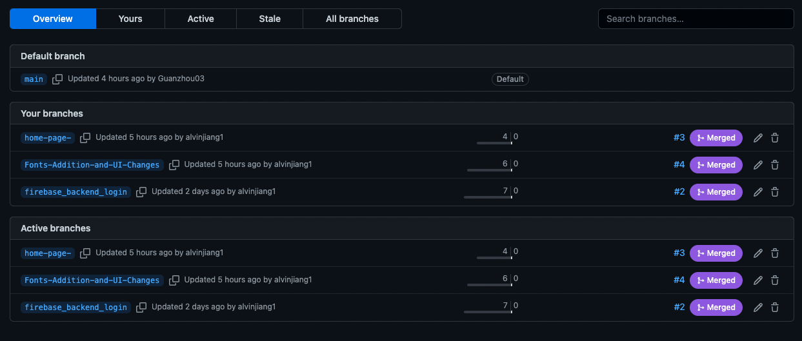{width="6.5in" height="2.763888888888889in"}

The branches within the red rectangle are active branches that we have
created and worked on in the past.

## Pull Requests:

Before each member pushes their work onto the main branch, we made use
of the pull requests feature on Git to ensure that both parties are well
informed on the changes that have been made. After reviewing the code
and testing on their own end, the other party will be the one to merge
changes onto the main branch. This ensures that both members are on the
same page.

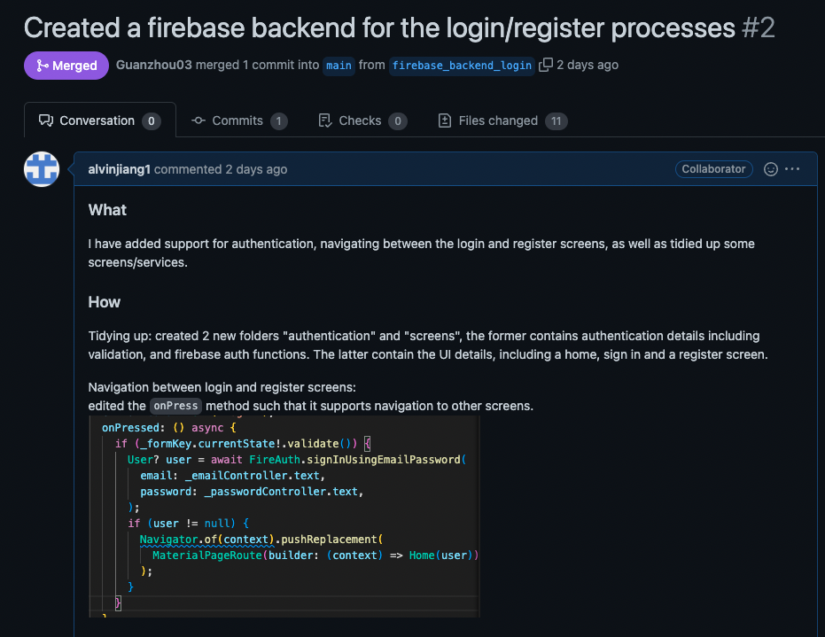{width="6.5in" height="5.013888888888889in"}

# Project Log

+----+---------------+--------+--------+-------+--------------------+
| S  | Task          | Date   | Chen   | Alvin | Remarks            |
| /N |               |        | Gu     | Jiang |                    |
|    |               |        | anzhou |       |                    |
+----+---------------+--------+--------+-------+--------------------+
| 1  | Liftoff       | 12 May | 3      | 3     | Initial Meeting +  |
|    | Submission    |        |        |       | Poster Design and  |
|    |               |        |        |       | Video Filming      |
+----+---------------+--------+--------+-------+--------------------+
| 2  | Mission       | 14 May | 4      | 4     | React Native + Git |
|    | Control 1     |        |        |       | Workshop           |
+----+---------------+--------+--------+-------+--------------------+
| 3  | Self-Learning | 14     | 25     | 25    | Both:              |
|    | of Tech Stack | May -  |        |       |                    |
|    |               | 31 May |        |       | React Native       |
|    |               |        |        |       | Basics             |
|    |               |        |        |       |                    |
|    |               |        |        |       | Flutter Basics     |
|    |               |        |        |       |                    |
|    |               |        |        |       | Firebase Basics    |
|    |               |        |        |       |                    |
|    |               |        |        |       | Frontend (Orbitee  |
|    |               |        |        |       | 1):                |
|    |               |        |        |       |                    |
|    |               |        |        |       | 1.  Making use of  |
|    |               |        |        |       |     existing       |
|    |               |        |        |       |     packages and   |
|    |               |        |        |       |     widgets        |
|    |               |        |        |       |                    |
|    |               |        |        |       | 2.  Learning from  |
|    |               |        |        |       |     online guides  |
|    |               |        |        |       |     to create card |
|    |               |        |        |       |     stack          |
|    |               |        |        |       |                    |
|    |               |        |        |       | 3.  Learning from  |
|    |               |        |        |       |     online guides  |
|    |               |        |        |       |     to create      |
|    |               |        |        |       |     profile page   |
|    |               |        |        |       |                    |
|    |               |        |        |       | Backend (Orbitee   |
|    |               |        |        |       | 2):                |
|    |               |        |        |       |                    |
|    |               |        |        |       | 1.  Integrating of |
|    |               |        |        |       |     firebase into  |
|    |               |        |        |       |     Flutter App    |
|    |               |        |        |       |                    |
|    |               |        |        |       | 2.  Firebase Auth  |
+----+---------------+--------+--------+-------+--------------------+
| 4  | Business Idea | 20 May | 1      | 1     |                    |
|    | Validation    |        |        |       |                    |
|    | Workshop      |        |        |       |                    |
+----+---------------+--------+--------+-------+--------------------+
| 5  | Git + GitHub  | 23 May | 2      | 2     |                    |
|    | setup and     |        |        |       |                    |
|    | first commit  |        |        |       |                    |
+----+---------------+--------+--------+-------+--------------------+
| 6  | Individual    | 23     | 9      | 9     | Frontend:          |
|    | Programming   | May -  |        |       |                    |
|    |               | 31 May |        |       | Design and         |
|    |               |        |        |       | implement basic    |
|    |               |        |        |       | Login, Register    |
|    |               |        |        |       | Page and Home Page |
|    |               |        |        |       | using Flutter      |
|    |               |        |        |       | Widgets, with text |
|    |               |        |        |       | editing and        |
|    |               |        |        |       | password hiding    |
|    |               |        |        |       |                    |
|    |               |        |        |       | Backend:           |
|    |               |        |        |       |                    |
|    |               |        |        |       | Set up Firebase    |
|    |               |        |        |       | backend, user      |
|    |               |        |        |       | authentication     |
|    |               |        |        |       | using Firebase     |
|    |               |        |        |       | Auth, validation   |
|    |               |        |        |       | logic, navigation  |
|    |               |        |        |       | between screens    |
+----+---------------+--------+--------+-------+--------------------+
| 7  | Check-in      | 26 May | 2      | 2     | Corroborate work,  |
|    | Meeting       |        |        |       | merge pending pull |
|    |               |        |        |       | requests, ideation |
|    |               |        |        |       | for future         |
|    |               |        |        |       | features.          |
+----+---------------+--------+--------+-------+--------------------+
| 8  | Work on MS1   | 26     | 6      | 6     | Writing of Readme  |
|    | Submission    | May -  |        |       | document, creating |
|    |               | 31 May |        |       | program flow       |
|    |               |        |        |       | chart, packaging   |
|    |               |        |        |       | app, demo video    |
|    |               |        |        |       | filming, project   |
|    |               |        |        |       | log.               |
+----+---------------+--------+--------+-------+--------------------+
| 9  | Final Team    | 28 May | 2      | 2     | Finalise           |
|    | Meeting       |        |        |       | deliverables:      |
|    | before MS1    |        |        |       | poster, video,     |
|    |               |        |        |       | ensure app is      |
|    |               |        |        |       | available for      |
|    |               |        |        |       | trying.            |
+----+---------------+--------+--------+-------+--------------------+
| M  |               |        |        |       |                    |
| il |               |        |        |       |                    |
| es |               |        |        |       |                    |
| to |               |        |        |       |                    |
| ne |               |        |        |       |                    |
| 1  |               |        |        |       |                    |
+----+---------------+--------+--------+-------+--------------------+
| 10 | Writing of    | 3      | 5      | 5     | Review other       |
|    | Peer Review   | June - |        |       | teams' materials,  |
|    | for other     | 6 June |        |       | testing technical  |
|    | teams         |        |        |       | proof of concept   |
|    |               |        |        |       | and writing peer   |
|    |               |        |        |       | evaluations.       |
+----+---------------+--------+--------+-------+--------------------+
| 11 | Team Meeting  | 7 June | 1      | 1     | Discussed feedback |
|    | to discuss    |        |        |       | from peer          |
|    | Peer          |        |        |       | evaluation and     |
|    | Evaluation    |        |        |       | created a work     |
|    | feedback      |        |        |       | plan for Milestone |
|    |               |        |        |       | 2.                 |
+----+---------------+--------+--------+-------+--------------------+
| 12 | Self-Learning | 7      | 10     | 10    | Both:              |
|    | of Tech Stack | June - |        |       |                    |
|    |               | 23     |        |       | Cloud Firestore    |
|    |               | June   |        |       |                    |
|    |               |        |        |       | Software Testing   |
|    |               |        |        |       | Techniques         |
|    |               |        |        |       |                    |
|    |               |        |        |       | Frontend:          |
|    |               |        |        |       |                    |
|    |               |        |        |       | 1.  Online guide   |
|    |               |        |        |       |     on creating    |
|    |               |        |        |       |     profile page.  |
|    |               |        |        |       |                    |
|    |               |        |        |       | 2.  Online guide   |
|    |               |        |        |       |     on creating    |
|    |               |        |        |       |     chat system    |
|    |               |        |        |       |                    |
|    |               |        |        |       | 3.  Using Flutter  |
|    |               |        |        |       |     packages       |
|    |               |        |        |       |                    |
|    |               |        |        |       | Backend:           |
|    |               |        |        |       |                    |
|    |               |        |        |       | 1.  Integrating    |
|    |               |        |        |       |     email          |
|    |               |        |        |       |     verification   |
|    |               |        |        |       |                    |
|    |               |        |        |       | 2.  Integrating    |
|    |               |        |        |       |     password reset |
|    |               |        |        |       |                    |
|    |               |        |        |       | 3.  Read and Write |
|    |               |        |        |       |     to Cloud       |
|    |               |        |        |       |     Firestore and  |
|    |               |        |        |       |     Firebase       |
|    |               |        |        |       |     Storage        |
+----+---------------+--------+--------+-------+--------------------+
| 13 | Individual    | 7      | 15     | 15    | Both:              |
|    | Programming   | June - |        |       |                    |
|    | (Profile      | 15     |        |       | Debugging after    |
|    | Page)         | June   |        |       | backend            |
|    |               |        |        |       | integration        |
|    |               |        |        |       |                    |
|    |               |        |        |       | Frontend:          |
|    |               |        |        |       |                    |
|    |               |        |        |       | 1.  Creating       |
|    |               |        |        |       |     Profile Page   |
|    |               |        |        |       |     user interface |
|    |               |        |        |       |                    |
|    |               |        |        |       | 2.  Coding and     |
|    |               |        |        |       |     debugging      |
|    |               |        |        |       |     Multi-Select   |
|    |               |        |        |       |     Form Field     |
|    |               |        |        |       |                    |
|    |               |        |        |       | Backend:           |
|    |               |        |        |       |                    |
|    |               |        |        |       | 1.  Email          |
|    |               |        |        |       |     Verification   |
|    |               |        |        |       |     integration    |
|    |               |        |        |       |                    |
|    |               |        |        |       | 2.  Backend        |
|    |               |        |        |       |     support for    |
|    |               |        |        |       |     Profile Page   |
+----+---------------+--------+--------+-------+--------------------+
| 14 | Individual    | 15     | 18     | 18    | Both:              |
|    | Programming   | June - |        |       |                    |
|    | (Chat Page,   | 23     |        |       | Debugging and      |
|    | Chat Request  | June   |        |       | testing after      |
|    | Page, Swipe   |        |        |       | backend            |
|    | System)       |        |        |       | integration        |
|    |               |        |        |       |                    |
|    |               |        |        |       | Frontend:          |
|    |               |        |        |       |                    |
|    |               |        |        |       | 1.  Design and     |
|    |               |        |        |       |     coding of      |
|    |               |        |        |       |     chats page,    |
|    |               |        |        |       |     chat request   |
|    |               |        |        |       |     page, and user |
|    |               |        |        |       |     information    |
|    |               |        |        |       |     page           |
|    |               |        |        |       |                    |
|    |               |        |        |       | 2.  Routing of     |
|    |               |        |        |       |     chats page and |
|    |               |        |        |       |     coding of      |
|    |               |        |        |       |     messaging      |
|    |               |        |        |       |     system         |
|    |               |        |        |       |                    |
|    |               |        |        |       | 3.  Give           |
|    |               |        |        |       |     assistance     |
|    |               |        |        |       |     regarding      |
|    |               |        |        |       |     backend        |
|    |               |        |        |       |     related        |
|    |               |        |        |       |     debugging      |
|    |               |        |        |       |                    |
|    |               |        |        |       | Backend:           |
|    |               |        |        |       |                    |
|    |               |        |        |       | 1.  Backend        |
|    |               |        |        |       |     support for    |
|    |               |        |        |       |     swipe system,  |
|    |               |        |        |       |     password reset |
|    |               |        |        |       |     page.          |
|    |               |        |        |       |                    |
|    |               |        |        |       | 2.  Backend        |
|    |               |        |        |       |     routing for    |
|    |               |        |        |       |     chats home     |
|    |               |        |        |       |     page, chat     |
|    |               |        |        |       |     request page.  |
|    |               |        |        |       |                    |
|    |               |        |        |       | 3.  Read and Write |
|    |               |        |        |       |     data after     |
|    |               |        |        |       |     chat request   |
|    |               |        |        |       |     acceptance.    |
|    |               |        |        |       |                    |
|    |               |        |        |       | 4.  Debug backend  |
|    |               |        |        |       |     related bugs   |
|    |               |        |        |       |     regarding      |
|    |               |        |        |       |     asynchronous   |
|    |               |        |        |       |     calls.         |
+----+---------------+--------+--------+-------+--------------------+
| 15 | Tidy code,    | 24     | 4      | 4     | Resolving poor     |
|    | improve UI,   | June   |        |       | syntax, and        |
|    | conduct Smoke |        |        |       | simplifying code,  |
|    | and           |        |        |       | write out smoke    |
|    | Regression    |        |        |       | test cases and     |
|    | Tests         |        |        |       | regression test    |
|    |               |        |        |       | cases and          |
|    |               |        |        |       | conducting them.   |
+----+---------------+--------+--------+-------+--------------------+
| 16 | User Testing  | 24     | 2      | 2     | Packaging the app  |
|    |               | June - |        |       | and sending it to  |
|    |               | 25     |        |       | a few of our close |
|    |               | June   |        |       | friends for user   |
|    |               |        |        |       | testing.           |
+----+---------------+--------+--------+-------+--------------------+
| 17 | Work on MS2   | 25     | 9      | 9     | Writing of readme, |
|    | Submission    | June - |        |       | creating frontend  |
|    |               | 27     |        |       | and backend tree   |
|    |               | June   |        |       | diagrams, updating |
|    |               |        |        |       | poster and video,  |
|    |               |        |        |       | project log.       |
+----+---------------+--------+--------+-------+--------------------+
| M  |               |        |        |       |                    |
| il |               |        |        |       |                    |
| es |               |        |        |       |                    |
| to |               |        |        |       |                    |
| ne |               |        |        |       |                    |
| 2  |               |        |        |       |                    |
+----+---------------+--------+--------+-------+--------------------+
| 18 | Peer review   | 28     | 4      | 4     | Review other       |
|    | on other      | June - |        |       | teams' materials,  |
|    | teams'        | 4 July |        |       | testing app        |
|    | projects      |        |        |       | features and       |
|    |               |        |        |       | writing peer       |
|    |               |        |        |       | evaluations.       |
+----+---------------+--------+--------+-------+--------------------+
| 19 | Team Meeting  | 4 July | 1      | 1     | Discussed feedback |
|    | to discuss    |        |        |       | from peer          |
|    | Peer          |        |        |       | evaluation and     |
|    | Evaluation    |        |        |       | created a work     |
|    | feedback      |        |        |       | plan for Milestone |
|    |               |        |        |       | 3.                 |
+----+---------------+--------+--------+-------+--------------------+
| 20 | Bug fixes and | 5-8    | 6      | 6     | Fixed a bug        |
|    | individual    | July   |        |       | regarding device   |
|    | learning of   |        |        |       | date time          |
|    | how to        |        |        |       | inconsistencies,   |
|    | implement     |        |        |       | changed chat       |
|    | required      |        |        |       | request decision   |
|    | features      |        |        |       | implementation to  |
|    |               |        |        |       | be in profile info |
|    |               |        |        |       | page, small        |
|    |               |        |        |       | improvements to    |
|    |               |        |        |       | profile fields     |
|    |               |        |        |       | (adding more       |
|    |               |        |        |       | options and        |
|    |               |        |        |       | fields).           |
+----+---------------+--------+--------+-------+--------------------+
| 21 | Mission       | 8 July | 2      | 2     |                    |
|    | Control 5     |        |        |       |                    |
|    | (Poster and   |        |        |       |                    |
|    | Video         |        |        |       |                    |
|    | Workshop)     |        |        |       |                    |
+----+---------------+--------+--------+-------+--------------------+
| 22 | Individual    | 9- 20  | 18     | 18    | Full stack         |
|    | Programming   | July   |        |       | implementation     |
|    | (Report user, |        |        |       | (Dart with         |
|    | block/unblock |        |        |       | Firestore Database |
|    | user, image   |        |        |       | support) ,         |
|    | sending       |        |        |       | testing, and       |
|    | features,     |        |        |       | debugging of:      |
|    | filter        |        |        |       |                    |
|    | system,       |        |        |       | 1.  Report user    |
|    | delete chat,  |        |        |       |     feature to the |
|    | r             |        |        |       |     administrator. |
|    | ecommendation |        |        |       |                    |
|    | algorithm     |        |        |       | 2.  Blocking/      |
|    | im            |        |        |       |                    |
|    | plementation, |        |        |       | > unblocking user  |
|    | feedback      |        |        |       | > feature to       |
|    | system, and   |        |        |       | > prevent further  |
|    | bug fixes)    |        |        |       | > chatting.        |
|    |               |        |        |       |                    |
|    |               |        |        |       | 3.  Delete chat    |
|    |               |        |        |       |     feature to     |
|    |               |        |        |       |     remove the     |
|    |               |        |        |       |     chat room and  |
|    |               |        |        |       |     smoothen chat  |
|    |               |        |        |       |     experience     |
|    |               |        |        |       |     once chat is   |
|    |               |        |        |       |     no longer      |
|    |               |        |        |       |     needed.        |
|    |               |        |        |       |                    |
|    |               |        |        |       | 4.  Image sending  |
|    |               |        |        |       |     feature (on    |
|    |               |        |        |       |     top of text,   |
|    |               |        |        |       |     emotes, and    |
|    |               |        |        |       |     other language |
|    |               |        |        |       |     support).      |
|    |               |        |        |       |                    |
|    |               |        |        |       | 5.  Filter system  |
|    |               |        |        |       |     to set and     |
|    |               |        |        |       |     save           |
|    |               |        |        |       |     preferences    |
|    |               |        |        |       |     (filter out    |
|    |               |        |        |       |     profiles to be |
|    |               |        |        |       |     shown in the   |
|    |               |        |        |       |     home page).    |
|    |               |        |        |       |                    |
|    |               |        |        |       | 6.  Recommendation |
|    |               |        |        |       |     algorithm to   |
|    |               |        |        |       |     order the      |
|    |               |        |        |       |     profile cards  |
|    |               |        |        |       |     so the         |
|    |               |        |        |       |     profiles with  |
|    |               |        |        |       |     similar        |
|    |               |        |        |       |     interests are  |
|    |               |        |        |       |     shown first in |
|    |               |        |        |       |     the home page. |
|    |               |        |        |       |                    |
|    |               |        |        |       | 7.  Feedback       |
|    |               |        |        |       |     system for     |
|    |               |        |        |       |     users to       |
|    |               |        |        |       |     provide        |
|    |               |        |        |       |     feedback or    |
|    |               |        |        |       |     report bugs.   |
|    |               |        |        |       |                    |
|    |               |        |        |       | 8.  Fixed a bug    |
|    |               |        |        |       |     where users    |
|    |               |        |        |       |     could swipe on |
|    |               |        |        |       |     a profile more |
|    |               |        |        |       |     than once.     |
|    |               |        |        |       |     (Each profile  |
|    |               |        |        |       |     can only be    |
|    |               |        |        |       |     swiped once)   |
+----+---------------+--------+--------+-------+--------------------+
| 23 | Automated     | 20 -   | 4      | 4     | Learned about      |
|    | Testing       | 21     |        |       | automated testing  |
|    |               | July   |        |       | and implemented    |
|    |               |        |        |       | test cases for     |
|    |               |        |        |       | automated testing  |
+----+---------------+--------+--------+-------+--------------------+
| 24 | Team Meeting  | 22     | 3      | 3     | Consolidated work  |
|    |               | July   |        |       | done for both      |
|    |               |        |        |       | Orbitee, testing   |
|    |               |        |        |       | of features and    |
|    |               |        |        |       | debugging, as well |
|    |               |        |        |       | as discussed UI    |
|    |               |        |        |       | improvements and   |
|    |               |        |        |       | minor bug fixes.   |
+----+---------------+--------+--------+-------+--------------------+
| 25 | UI            | 22 -   | 2      | 2     | UI Improvements on |
|    | Improvements  | 23     |        |       | set your           |
|    |               | July   |        |       | preference screen, |
|    |               |        |        |       | as well as         |
|    |               |        |        |       | improved alignment |
|    |               |        |        |       | and formatting in  |
|    |               |        |        |       | profile page, home |
|    |               |        |        |       | page, profile info |
|    |               |        |        |       | page in chat       |
|    |               |        |        |       | requests and       |
|    |               |        |        |       | feedback page.     |
+----+---------------+--------+--------+-------+--------------------+
| 26 | Team Meeting, | 24     | 6      | 6     | Conducted smoke,   |
|    | Software      | July   |        |       | regression and     |
|    | Testing and   |        |        |       | user tests. 7      |
|    | tidying up    |        |        |       | users tested the   |
|    | code          |        |        |       | app and gave       |
|    |               |        |        |       | feedback on each   |
|    |               |        |        |       | feature with       |
|    |               |        |        |       | minimal            |
|    |               |        |        |       | instructions.      |
|    |               |        |        |       | Cleaned up some    |
|    |               |        |        |       | code and minor bug |
|    |               |        |        |       | fixes.             |
+----+---------------+--------+--------+-------+--------------------+
| 27 | Working on    | 24 -   | 8      | 8     | Documentation of   |
|    | Milestone 3   | 25     |        |       | software testing,  |
|    | Submission    | July   |        |       | problems           |
|    |               |        |        |       | encountered,       |
|    |               |        |        |       | features           |
|    |               |        |        |       | developed, bugs    |
|    |               |        |        |       | squashed, making   |
|    |               |        |        |       | of video demo and  |
|    |               |        |        |       | poster.            |
+----+---------------+--------+--------+-------+--------------------+
| M  |               |        |        |       |                    |
| il |               |        |        |       |                    |
| es |               |        |        |       |                    |
| to |               |        |        |       |                    |
| ne |               |        |        |       |                    |
| 3  |               |        |        |       |                    |
+----+---------------+--------+--------+-------+--------------------+

  ------------------------ ---------------------- -----------------------
  **Total Hours**          **Orbitee 1**          **Orbitee 2**

  **172**                  **172**                **172**
  ------------------------ ---------------------- -----------------------

[^1]: Labrague, L. J., Santos, J. A., & Falguera, C. (2020). Social and
    emotional loneliness among college students during the COVID-19
    pandemic: The predictive role of coping behaviours, social support,
    and personal resilience. https://doi.org/10.21203/rs.3.rs-93878/v1
